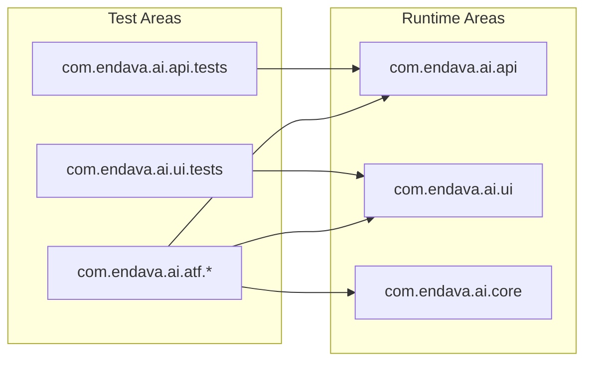
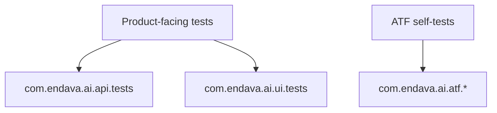
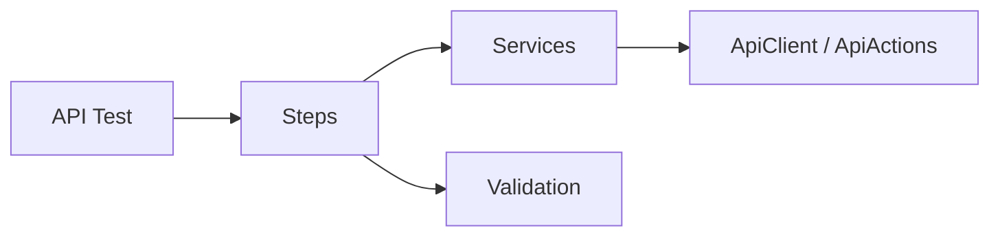
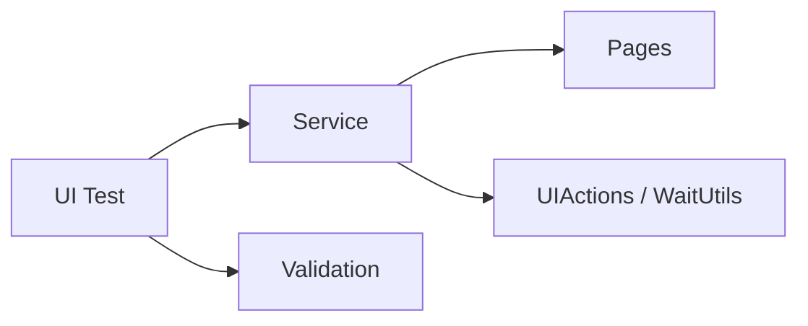
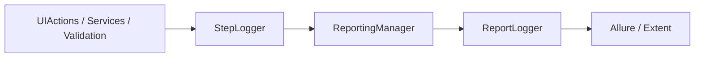
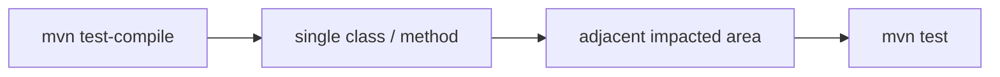
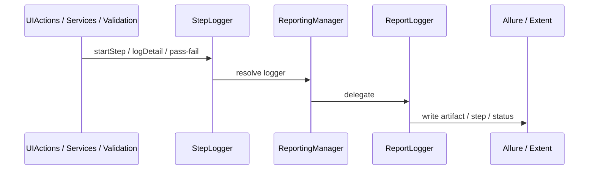

# Test Automation Framework

## Purpose

This repository is an existing enterprise-style Automation Testing Framework (ATF) for:

- UI automation
- API automation
- unified reporting
- framework contract validation

It is not a greenfield sample. The existing repository structure, base classes, reporting lifecycle, listeners, utilities, and test patterns are the source of truth.

The canonical architecture reference is:

- `docs/Living_Architecture_UI_API_doc_v1_0.html`

This README translates that architecture into practical day-to-day usage for engineers and future AI/MCP-assisted contributors.

## Quick Start

For a fast local start:

1. Review `src/main/resources/framework.properties`
2. Choose a reporting engine: `reporting.engine=extent` or `reporting.engine=allure`
3. If you run API write scenarios, set a valid `auth.token`
4. Compile tests:

   ```bash
   mvn test-compile
   ```

5. Run a narrow suite first:

   ```bash
   mvn "-Dtest=com.endava.ai.api.tests.PositiveUserTests" test
   ```

6. Inspect reports:
   - Extent: open `target/reports/ExtentReport_<timestamp>.html`
   - Allure:

     ```bash
     mvn allure:serve
     ```

Recommended onboarding order:

1. Read `Purpose`
2. Read `Source Of Truth`
3. Read `High-Level Architecture`
4. Read `Core Design Patterns`
5. Use `How To Run Tests`
6. Use `How To View Reports`

## Table of Contents

### Onboarding

- [Purpose](#purpose)
- [Quick Start](#quick-start)
- [Source Of Truth](#source-of-truth)
- [High-Level Architecture](#high-level-architecture)
- [Repository Structure](#repository-structure)
- [Core Design Patterns](#core-design-patterns)

### Daily Usage

- [UI vs API vs Reporting](#ui-vs-api-vs-reporting)
- [Configuration](#configuration)
- [Test Data And Schemas](#test-data-and-schemas)
- [How To Run Tests](#how-to-run-tests)
- [How To View Reports](#how-to-view-reports)

### Extending The Framework

- [Adding New API Tests](#adding-new-api-tests)
- [Adding New UI Tests](#adding-new-ui-tests)
- [Adding New Framework / Contract Tests](#adding-new-framework--contract-tests)
- [Reporting Semantics](#reporting-semantics)
- [What Was Extracted From The Living Architecture Document](#what-was-extracted-from-the-living-architecture-document)
- [MCP / AI-Assisted Test Generation Guidance](#mcp--ai-assisted-test-generation-guidance)
- [Practical Conventions For Contributors](#practical-conventions-for-contributors)
- [Final Guidance](#final-guidance)

## Source Of Truth

When extending the framework, use this priority order:

1. Existing Java code in `src/main/java`
2. Existing tests in `src/test/java`
3. `docs/Living_Architecture_UI_API_doc_v1_0.html`
4. `src/main/resources/framework.properties`
5. `pom.xml`

Do not invent parallel abstractions if an equivalent framework component already exists.

## High-Level Architecture

The framework is split into three main runtime areas:

- `com.endava.ai.api`
- `com.endava.ai.ui`
- `com.endava.ai.core`

And three main test areas:

- `com.endava.ai.api.tests`
- `com.endava.ai.ui.tests`
- `com.endava.ai.atf.*`

The intent is:

- `com.endava.ai.api.tests`: business/API coverage
- `com.endava.ai.ui.tests`: business/UI coverage
- `com.endava.ai.atf.*`: framework self-tests, lifecycle tests, reporting contract tests, smoke tests, legacy/reference tests

This distinction matters. New product-facing tests should normally go into `com.endava.ai.api.tests` or `com.endava.ai.ui.tests`, while framework contract tests belong under `com.endava.ai.atf.*`.





## Repository Structure

Use this mental map first:

- `src/main/java/com/endava/ai/api`: API runtime layers
- `src/main/java/com/endava/ai/ui`: UI runtime layers
- `src/main/java/com/endava/ai/core`: shared config, listeners, reporting, core infrastructure
- `src/test/java/com/endava/ai/api/tests`: business API tests
- `src/test/java/com/endava/ai/ui/tests`: business UI tests
- `src/test/java/com/endava/ai/atf/*`: framework self-tests and contracts

<details>
<summary>Full repository structure</summary>

```text
.
|-- docs/
|   `-- Living_Architecture_UI_API_doc_v1_0.html
|-- pom.xml
|-- README.md
|-- src/
|   |-- main/
|   |   |-- java/com/endava/ai/
|   |   |   |-- api/
|   |   |   |   |-- client/
|   |   |   |   |-- core/
|   |   |   |   |-- factory/
|   |   |   |   |-- model/
|   |   |   |   |-- service/
|   |   |   |   |-- steps/
|   |   |   |   |-- utils/
|   |   |   |   `-- validation/
|   |   |   |-- core/
|   |   |   |   |-- config/
|   |   |   |   |-- listener/
|   |   |   |   `-- reporting/
|   |   |   `-- ui/
|   |   |       |-- core/
|   |   |       |-- engine/
|   |   |       |-- factory/
|   |   |       |-- model/
|   |   |       |-- pages/
|   |   |       |-- reporting/
|   |   |       |-- service/
|   |   |       |-- utils/
|   |   |       `-- validation/
|   |   `-- resources/
|   |       `-- framework.properties
|   `-- test/
|       |-- java/com/endava/ai/
|       |   |-- api/tests/
|       |   |-- atf/api/
|       |   |-- atf/reporting/
|       |   |-- atf/ui/
|       |   `-- ui/tests/
|       `-- resources/
|           |-- allure.properties
|           |-- schemas/
|           `-- testdata/
```

</details>

## Core Design Patterns

### 1. Base Test Pattern

The framework uses dedicated base classes:

- `com.endava.ai.api.core.BaseTestAPI`
- `com.endava.ai.ui.core.BaseTestUI`

Responsibilities:

- attach TestNG listeners
- initialize common runtime infrastructure
- enforce API/UI lifecycle boundaries

Current behavior:

- `BaseTestAPI` initializes `ApiClient` and checks `auth.token`
- `BaseTestUI` initializes and closes the UI engine through `DriverManager`

The base classes own setup/teardown concerns. Tests should not manually rebuild framework lifecycle behavior.

### 2. Steps -> Services -> Validation

For API, the dominant pattern is:

- tests orchestrate intent
- `Steps` compose business flows
- `Services` perform HTTP calls
- `Validation` classes/assertions produce verdicts

Representative classes:

- `com.endava.ai.api.steps.UsersSteps`
- `com.endava.ai.api.service.UsersService`
- `com.endava.ai.api.validation.ResponseValidator`
- `com.endava.ai.api.validation.SchemaValidator`
- `com.endava.ai.api.validation.ApiContractValidator`

This gives:

- readable test intent
- reusable HTTP flows
- reusable semantic assertions
- better reporting granularity



### 3. Page Object + Service Pattern

For UI, the dominant pattern is:

- tests describe business scenario
- services orchestrate user flows
- page objects hold selectors only
- validation classes own assertions

Representative classes:

- `com.endava.ai.ui.service.RegistrationService`
- `com.endava.ai.ui.pages.RegisterPage`
- `com.endava.ai.ui.validation.RegistrationValidation`

Do not put assertions into services.
Do not put business flow logic into page objects.



### 4. Centralized Engine Abstraction

UI engine selection is centralized:

- `com.endava.ai.ui.engine.UIEngineFactory`
- `com.endava.ai.ui.core.DriverManager`

Supported engines:

- `selenium`
- `playwright`

Selection is controlled by `ui.engine` in `framework.properties`.

### 5. Semantic Action Layer

UI interactions go through:

- `com.endava.ai.ui.utils.UIActions`
- `com.endava.ai.ui.utils.WaitUtils`

API calls go through:

- `com.endava.ai.api.client.ApiClient`
- `com.endava.ai.api.client.ApiActions`

This is important because these layers also carry:

- step semantics
- logging
- reporting integration
- engine-aware behavior

### 6. Centralized Reporting Contract

Reporting is unified through:

- `com.endava.ai.core.reporting.ReportLogger`
- `com.endava.ai.core.reporting.ReportingManager`
- `com.endava.ai.core.reporting.StepLogger`
- `com.endava.ai.core.listener.TestListener`

Adapters:

- `com.endava.ai.core.reporting.adapters.AllureAdapter`
- `com.endava.ai.core.reporting.adapters.ExtentAdapter`

This means tests, services, validations, and UI/API layers should never talk directly to Allure or Extent.



## UI vs API vs Reporting

At a glance:

- UI owns browser/session behavior and UI-specific artifacts
- API owns HTTP flows, auth propagation, and response contracts
- Reporting is shared infrastructure and must remain isolated from business logic

<details>
<summary>UI layer details</summary>

UI concerns live under `com.endava.ai.ui`.

Responsibilities:

- browser/session ownership
- page selectors
- UI actions
- engine-specific behavior hidden behind `UIEngine`
- UI-specific screenshot handling

Must use:

- `BaseTestUI`
- `DriverManager`
- `UIActions`
- `WaitUtils`
- page objects
- UI services
- UI validations

Must not do:

- direct WebDriver/Playwright logic in test methods
- direct reporting adapter calls
- API-specific auth/request logic

</details>

<details>
<summary>API layer details</summary>

API concerns live under `com.endava.ai.api`.

Responsibilities:

- request creation
- auth propagation
- service calls
- semantic API reporting
- response validation
- schema validation
- data factories/builders

Must use:

- `BaseTestAPI`
- `ApiClient`
- `ApiActions`
- `Steps`
- `Services`
- validators

Must not do:

- browser initialization
- screenshot lifecycle
- UI dependencies
- direct adapter calls

</details>

<details>
<summary>Reporting layer details</summary>

Reporting concerns live under `com.endava.ai.core.reporting` and `com.endava.ai.atf.reporting`.

Responsibilities:

- test lifecycle logging
- step lifecycle logging
- adapter selection
- screenshot attachment orchestration
- payload attachment orchestration
- framework-level reporting contract tests

Reporting is cross-cutting, but it must remain isolated from business logic.

</details>

## Configuration

Runtime configuration is centralized in:

- `src/main/resources/framework.properties`

Important keys are grouped below.

<details>
<summary>URLs</summary>

- `base.url=https://practicesoftwaretesting.com`
- `base.url.api=https://gorest.co.in`

</details>

<details>
<summary>UI</summary>

- `ui.engine=selenium|playwright`
- `ui.headless=true|false`
- `ui.window.mode=fullscreen`
- `ui.window.size=WIDTHxHEIGHT`
- `ui.page.zoom.percent=...`
- `ui.wait.timeout.seconds=...`

</details>

<details>
<summary>API</summary>

- `auth.token=...`
- `api.wait.timeout.seconds=...`
- `api.rate.limit.max.retries=...`
- `api.rate.limit.retry.default.delay.seconds=...`
- `api.rate.limit.retry.max.delay.seconds=...`

</details>

<details>
<summary>Reporting</summary>

- `reporting.engine=allure|extent`
- `reports.dir=target/reports`
- `reports.timestamp.enabled=true|false`
- `reports.timestamp.format=...`
- `console.details.enabled=true|false`

</details>

<details>
<summary>Screenshots</summary>

- `ui.screenshots.enabled=true|false`
- `ui.screenshots.on.failure.only=true|false`
- `ui.screenshots.capture.final.state=true|false`

</details>

<details>
<summary>Current framework.properties example</summary>

```properties
# =========================================================
# BASE URLS
base.url=https://practicesoftwaretesting.com
base.url.api=https://gorest.co.in

# =========================================================
# AUTH
auth.token=64a4cad05f87de40f6c75e39a0025c53ad298fea597a0deb47490c5ff02d01bd

# UI ENGINE
# options: selenium, playwright
# =========================================================
ui.engine=selenium
ui.headless=false

# UI WINDOW
# ui.window.mode options: fullscreen
# ui.window.size format: WIDTHxHEIGHT
# =========================================================
ui.window.mode=fullscreen
ui.window.size=
ui.page.zoom.percent=60

# UI SCREENSHOTS
# =========================================================
ui.screenshots.enabled=true
ui.screenshots.on.failure.only=false
ui.screenshots.capture.final.state=true

# WAITS & RETRIES
# =========================================================
ui.wait.timeout.seconds=5
api.wait.timeout.seconds=10

api.rate.limit.max.retries=2
api.rate.limit.retry.default.delay.seconds=5
api.rate.limit.retry.max.delay.seconds=65

# REPORTING
# reporting.engine options: allure, extent
# =========================================================
reporting.engine=extent
reports.dir=target/reports

reports.timestamp.enabled=true
reports.timestamp.format=yyyy-MM-dd_HH-mm-ss

console.details.enabled=true
```

</details>

## Test Data And Schemas

Current convention:

- JSON test data under `src/test/resources/testdata`
- JSON schemas under `src/test/resources/schemas`

Recommended usage:

- UI: use factories plus JSON-backed seed data where appropriate
- API: use factories for randomized or deterministic object creation
- schemas: validate response contracts in a dedicated validation step

<details>
<summary>Examples and supporting utilities</summary>

Examples:

- `testdata/registration_positive.json`
- `testdata/NegativeUserTests_invalid_email.json`
- `schemas/user.json`

Supporting utilities/factories:

- `com.endava.ai.api.utils.JsonUtils`
- `com.endava.ai.api.factory.UserFactory`
- `com.endava.ai.ui.factory.UserDataFactory`
- `com.endava.ai.api.utils.DataGenerator`
- `com.endava.ai.ui.utils.DataGenerator`

</details>

## How To Run Tests

### Summary

Use the narrowest possible Maven command first. The recommended progression is:

1. `mvn test-compile`
2. run a single class or method
3. run adjacent impacted classes
4. run the broader area
5. run `mvn test` only when the branch is stable enough

### Most Common Commands

Compile:

```bash
mvn test-compile
```

Run one test:

```bash
mvn "-Dtest=com.endava.ai.api.tests.PositiveUserTests" test
```

Run the full suite:

```bash
mvn test
```



<details>
<summary>Detailed run examples and workflow notes</summary>

### Single-class examples

API:

```bash
mvn "-Dtest=com.endava.ai.api.tests.PositiveUserTests" test
```

UI/framework-style:

```bash
mvn "-Dtest=com.endava.ai.atf.ui.RegistrationTests" test
```

Reporting contract:

```bash
mvn "-Dtest=com.endava.ai.atf.reporting.screenshot.FinalUiScreenshotContractTest" test
```

### Single-method example

```bash
mvn "-Dtest=com.endava.ai.api.tests.PositiveUserTests#create_wait_and_delete_user" test
```

### Multiple classes

```bash
mvn "-Dtest=com.endava.ai.api.tests.PositiveUserTests,com.endava.ai.atf.api.tests.NegativeUserTests" test
```

### Workflow reminder

1. `mvn test-compile`
2. run the narrowest impacted class
3. run adjacent impacted classes
4. run the broader area
5. run `mvn test` only when the branch is stable enough

</details>

## How To View Reports

Quick lookup:

- Allure results: `target/allure-results`
- Extent HTML: `target/reports/ExtentReport_<timestamp>.html`
- Fastest local view:
  - Allure: `mvn allure:serve`
  - Extent: open the generated HTML file directly

<details>
<summary>Allure usage</summary>

Prerequisites:

- set `reporting.engine=allure`
- run tests

Generate static HTML:

```bash
mvn allure:report
```

Open interactive local report:

```bash
mvn allure:serve
```

Notes:

- `src/test/resources/allure.properties` points Allure results to `target/allure-results`
- `allure:serve` is the fastest way to inspect a local run

</details>

<details>
<summary>Extent usage</summary>

Prerequisites:

- set `reporting.engine=extent`
- run tests

Results directory:

- `target/reports`

Typical report file:

- `target/reports/ExtentReport_<timestamp>.html`

Open the generated HTML report directly in a browser.

</details>

<details>
<summary>Reporting contract notes and self-test areas</summary>

The framework has dedicated reporting self-tests under:

- `com.endava.ai.atf.reporting.adapters`
- `com.endava.ai.atf.reporting.lifecycle`
- `com.endava.ai.atf.reporting.regression`
- `com.endava.ai.atf.reporting.screenshot`
- `com.endava.ai.atf.reporting.attachment`
- `com.endava.ai.atf.reporting.window`

Use these when changing:

- reporting adapters
- listener lifecycle
- screenshot behavior
- payload attachment behavior
- step semantics

</details>

## Adding New API Tests

New business/API tests should go under:

- `src/test/java/com/endava/ai/api/tests`

Short rule set:

- extend `BaseTestAPI`
- prefer `Steps -> Services -> Validation`
- reuse validators first
- keep cleanup in the test class or step helper
- keep tests isolated and rerunnable

<details>
<summary>Recommended recipe and API rules</summary>

### Recommended Recipe

1. Extend `BaseTestAPI`
2. Create or reuse a `Steps` class
3. Use existing `Service` classes for HTTP access
4. Use existing validators first
5. Add schema files under `src/test/resources/schemas` if needed
6. Add JSON test data under `src/test/resources/testdata` only when static data is useful
7. Keep cleanup in the test class or step helper

### API Rules To Preserve

- tests orchestrate, they do not build raw HTTP logic inline
- prefer `Steps -> Services -> Validation`
- reuse `ResponseValidator`, `SchemaValidator`, `ApiContractValidator`
- use `ApiActions` for reporting-aware HTTP calls
- avoid browser/UI imports
- keep tests isolated and rerunnable

### Business Tests vs Framework Tests

Put new business coverage here:

- `com.endava.ai.api.tests`

Put framework-level API lifecycle or legacy contract tests here:

- `com.endava.ai.atf.api.*`

</details>

<details>
<summary>Minimal API skeleton example</summary>

```java
package com.endava.ai.api.tests;

import com.endava.ai.api.core.BaseTestAPI;
import com.endava.ai.api.steps.UsersSteps;
import com.endava.ai.api.validation.ResponseValidator;
import io.restassured.response.Response;
import org.testng.annotations.BeforeMethod;
import org.testng.annotations.Test;

public class UserLookupTests extends BaseTestAPI {

    private UsersSteps users;

    @BeforeMethod(alwaysRun = true)
    public void setUp() {
        users = new UsersSteps();
    }

    @Test(description = "Get user by id returns 200")
    public void get_user_by_id_returns_200() {
        Response response = users.getUser(123);
        ResponseValidator.statusIs(response, 200);
    }
}
```

</details>

<details>
<summary>Extended API contribution guidance</summary>

Before adding a new API helper, check whether the framework already has a suitable layer in:

- `client`
- `service`
- `steps`
- `validation`
- `factory`
- `utils`

Prefer extending those layers over introducing new abstractions. If a test validates product behavior, it belongs under `com.endava.ai.api.tests`. If it validates lifecycle, reporting semantics, adapters, or framework contracts, it belongs under `com.endava.ai.atf.api.*` or `com.endava.ai.atf.reporting.*`.

</details>

## Adding New UI Tests

New business/UI tests should go under:

- `src/test/java/com/endava/ai/ui/tests`

Important context:

- `com.endava.ai.ui.tests.Example` is a recorder-style Playwright reference, not the target framework style
- `com.endava.ai.atf.ui.RegistrationTests` is the better style reference for layering and framework usage

Short rule set:

- extend `BaseTestUI`
- keep selectors only in page objects
- keep assertions only in validation classes
- keep flow in services
- reuse `UIActions`, `WaitUtils`, factories, and validations

<details>
<summary>Recommended recipe and UI rules</summary>

### Recommended Recipe

1. Extend `BaseTestUI`
2. Reuse an existing service if it fits
3. Put selectors only in page objects
4. Put assertions only in validation classes
5. Use `UIActions` instead of talking to the engine directly
6. Reuse factory/data-generator utilities for unique users and valid defaults

### UI Rules To Preserve

- page objects contain selectors, not assertions
- services orchestrate flow, not verdicts
- validations own assertions
- tests stay readable and business-oriented
- no direct `DriverManager.getEngine()` in normal business tests

</details>

<details>
<summary>Minimal UI skeleton example</summary>

```java
package com.endava.ai.ui.tests;

import com.endava.ai.ui.core.BaseTestUI;
import com.endava.ai.ui.service.RegistrationService;
import com.endava.ai.ui.validation.RegistrationValidation;
import org.testng.annotations.Test;

public class RegistrationSmokeTests extends BaseTestUI {

    private final RegistrationService service = new RegistrationService();
    private final RegistrationValidation validation = new RegistrationValidation();

    @Test(description = "Valid registration redirects to login")
    public void valid_registration_redirects_to_login() {
        service.openRegister();
        service.registerValidUser();
        validation.assertRedirectedToLogin();
    }
}
```

</details>

<details>
<summary>Extended UI contribution guidance</summary>

When converting a recorded flow into a production-ready test, treat `com.endava.ai.ui.tests.Example` as behavior reference only. The preferred structural reference is `com.endava.ai.atf.ui.RegistrationTests`. Keep selectors in page objects, flow in services, and verdicts in validation classes. Preserve screenshot and reporting behavior by reusing `BaseTestUI`, `UIActions`, `WaitUtils`, `DriverManager`, page objects, services, and validations.

</details>

## Adding New Framework / Contract Tests

Use `com.endava.ai.atf.*` for tests that validate the framework itself.

Examples:

- lifecycle ordering
- screenshot contracts
- reporting adapter behavior
- payload attachment rules
- engine contract tests
- framework smoke/regression checks

<details>
<summary>Current locations and placement rule</summary>

Current locations:

- `src/test/java/com/endava/ai/atf/api`
- `src/test/java/com/endava/ai/atf/reporting`
- `src/test/java/com/endava/ai/atf/ui`

If a test validates ATF behavior rather than product behavior, it belongs here.

</details>

## Reporting Semantics

The architecture document strongly implies these runtime semantics, and the code follows them:

- each semantic action should create a step
- steps should contain details
- payloads should be attached as code blocks only when meaningful
- failures should be owned by the failing step or listener
- screenshot attachment remains UI-only

Current important runtime classes:

- `com.endava.ai.core.listener.TestListener`
- `com.endava.ai.core.reporting.StepLogger`
- `com.endava.ai.core.reporting.ReportingManager`
- `com.endava.ai.ui.reporting.UiScreenshotFailureHandler`

This means:

- UI/API tests share a reporting backbone
- UI-specific attachments are guarded by active UI engine/session
- API tests must not accidentally trigger screenshot behavior



<details>
<summary>Reporting contract notes</summary>

When changing payload, step, adapter, screenshot, or listener behavior, validate the relevant framework self-tests under `com.endava.ai.atf.reporting.*`. These contract tests exist specifically to keep Allure and Extent behavior aligned and to keep business tests insulated from reporting implementation changes.

</details>

## What Was Extracted From The Living Architecture Document

The file `docs/Living_Architecture_UI_API_doc_v1_0.html` reinforces these core principles:

- one shared core module for config/listeners/reporting
- strict separation between UI, API, and reporting responsibilities
- tests should remain thin orchestration layers
- API should use `Steps -> Services -> Validation`
- UI should use `Tests -> Services -> Pages / Validation`
- reporting must be adapter-based and centrally managed
- engines must stay swappable behind stable contracts

In practice, the README guidance above is derived from that document plus the current Java implementation.

<details>
<summary>Living architecture notes for contributors</summary>

Use the living architecture document to confirm intent, not to override the codebase. When docs and code drift, the repository implementation is the higher-priority source of truth. The document is most useful for understanding boundaries, layering, lifecycle ownership, and reporting responsibilities.

</details>

## MCP / AI-Assisted Test Generation Guidance

Future MCP or AI-assisted generation should preserve the ATF, not bypass it.

### Goal

Use MCP/AI to accelerate:

- generating new test scenarios
- converting examples/recordings into ATF tests
- expanding API coverage
- drafting page objects, factories, validators, and schemas

Without breaking:

- package structure
- reporting lifecycle
- UI/API separation
- existing test patterns

### Non-Negotiable Guardrails

AI-generated code must:

- reuse `BaseTestAPI` / `BaseTestUI`
- reuse `UIActions`, `ApiActions`, `Steps`, `Services`, validators, factories
- keep selectors in page objects only
- keep assertions in validation classes only
- keep reporting through `StepLogger` and existing runtime layers
- keep UI/browser logic out of API tests
- keep API request logic out of UI tests

AI-generated code must not:

- create framework-v2 wrappers
- call Allure/Extent directly from tests
- add direct Selenium/Playwright code into business tests
- duplicate page objects, validators, or builders unnecessarily

<details>
<summary>MCP Prompt Templates</summary>

### MCP Prompt Template: Add New API Tests

Use a prompt like:

```text
You are extending an existing Java ATF.

Source of truth:
- src/main/java/com/endava/ai/api
- src/test/java/com/endava/ai/api/tests
- src/test/java/com/endava/ai/atf/api
- src/main/resources/framework.properties
- docs/Living_Architecture_UI_API_doc_v1_0.html

Rules:
- Reuse BaseTestAPI, ApiClient, ApiActions, Steps, Services, validators, factories.
- Put new business tests under com.endava.ai.api.tests.
- Put framework self-tests under com.endava.ai.atf.api.
- Keep tests isolated and rerunnable.
- Use Steps -> Services -> Validation.
- Do not introduce browser/UI logic.
- Do not call reporting adapters directly.

Task:
- Add focused API tests for <resource/behavior>.
- Reuse existing validators first.
- Add schema/testdata only if needed.
- Keep reporting and cleanup behavior consistent.
```

### MCP Prompt Template: Convert A Recorded UI Example

Use a prompt like:

```text
Transform the recorded flow into the existing ATF style.

Source of truth:
- com.endava.ai.ui.tests.Example is behavior reference only
- com.endava.ai.atf.ui.RegistrationTests is preferred framework style
- reuse BaseTestUI, UIActions, pages, services, validations, factories

Rules:
- New business UI tests go under com.endava.ai.ui.tests
- Keep selectors only in page objects
- Keep assertions only in validation classes
- Keep business flow in services
- Do not embed direct Playwright/Selenium code in tests
- Preserve existing reporting and screenshot lifecycle

Output:
- page object updates if needed
- service methods if needed
- validation methods if needed
- focused business-oriented tests
```

### MCP Prompt Template: Reporting / Framework Changes

Use a prompt like:

```text
You are changing framework behavior, not product tests.

Source of truth:
- com.endava.ai.core.reporting
- com.endava.ai.core.listener
- com.endava.ai.atf.reporting
- docs/Living_Architecture_UI_API_doc_v1_0.html

Rules:
- Preserve ReportLogger, ReportingManager, StepLogger, TestListener contracts
- Add or update framework self-tests under com.endava.ai.atf.reporting
- Do not change UI/API business tests unless compatibility requires it
- Validate both Allure and Extent behavior
```

</details>

<details>
<summary>Extended MCP contribution guidance and review checklist</summary>

### MCP Review Checklist

Before accepting AI-generated changes, verify:

- correct package placement
- no duplicated abstractions
- listener/reporting lifecycle untouched unless intentionally updated
- schema/testdata paths are correct
- UI/API isolation preserved
- test names are business-readable
- cleanup exists where needed
- targeted Maven runs pass

</details>

## Practical Conventions For Contributors

Quick reminders:

- API business style: `src/test/java/com/endava/ai/api/tests`
- UI business style: `src/test/java/com/endava/ai/atf/ui/RegistrationTests.java`
- UI recorder reference only: `src/test/java/com/endava/ai/ui/tests/Example.java`
- Reporting contracts: `src/test/java/com/endava/ai/atf/reporting`

<details>
<summary>Preferred layers and stability anchors</summary>

- API: `tests -> steps -> service -> validation`
- UI: `tests -> service -> pages / validation`
- reporting: `StepLogger -> ReportingManager -> ReportLogger -> adapter`

- `BaseTestAPI`
- `BaseTestUI`
- `DriverManager`
- `UIEngineFactory`
- `ApiClient`
- `ApiActions`
- `TestListener`
- `ReportingManager`
- `StepLogger`

</details>

<details>
<summary>Extended contributor notes</summary>

When you are unsure where a new test belongs, ask whether it validates product behavior or framework behavior. Product behavior belongs under `com.endava.ai.api.tests` or `com.endava.ai.ui.tests`. Framework behavior belongs under `com.endava.ai.atf.*`. This single distinction prevents most structural drift.

</details>

## Final Guidance

If you are adding coverage:

- keep business tests under `com.endava.ai.api.tests` or `com.endava.ai.ui.tests`
- keep framework self-tests under `com.endava.ai.atf.*`
- reuse the existing layers before adding new ones
- prefer targeted Maven runs first
- inspect reports after meaningful changes

If you are unsure where something belongs, ask:

- Is this validating product behavior?
- Or is it validating ATF behavior?

That answer usually tells you whether the code belongs in:

- `com.endava.ai.api.tests` / `com.endava.ai.ui.tests`
- or `com.endava.ai.atf.*`
