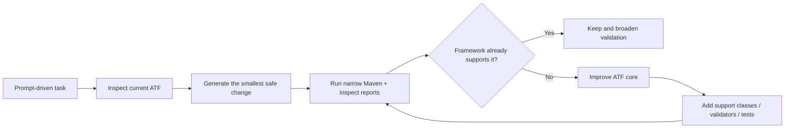
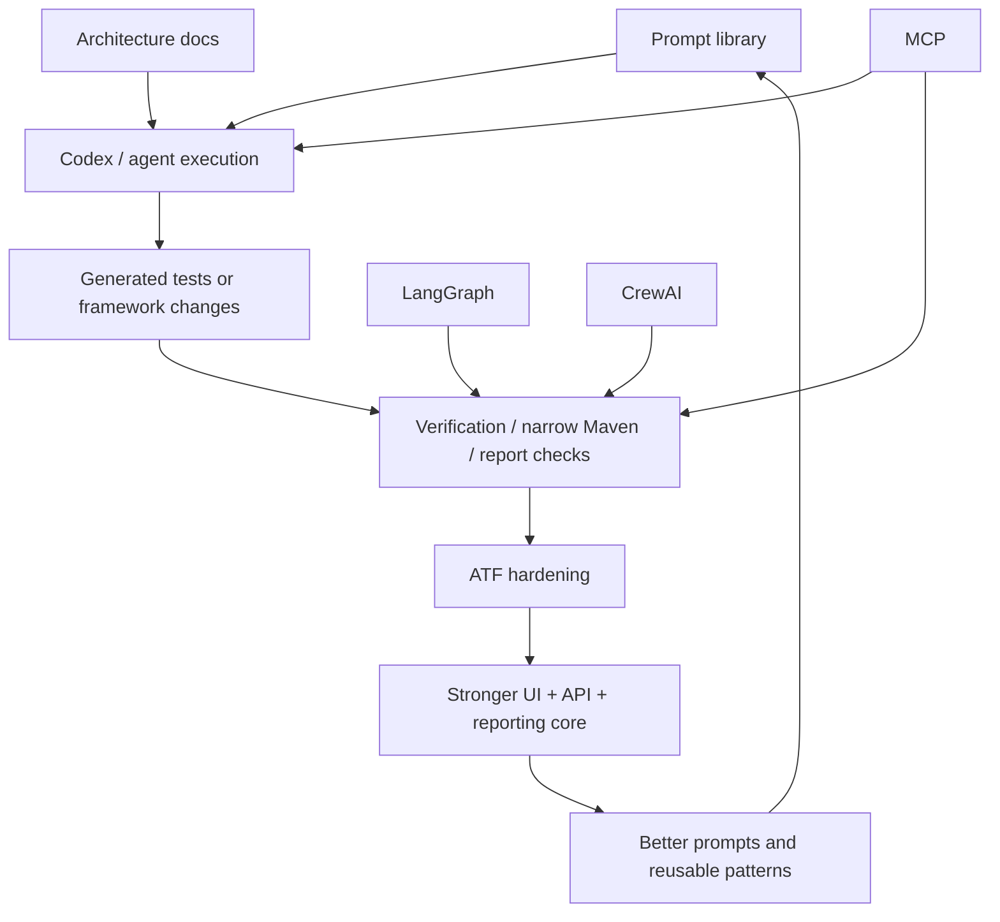
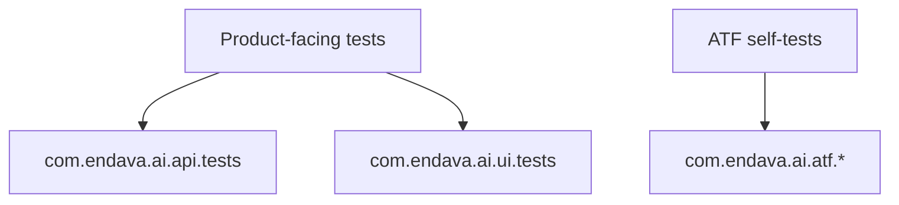
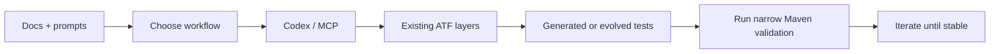

# Test Automation Framework

Java ATF for `UI + API + reporting`, evolved iteratively with `AI prompts + Codex + Maven validation`.

The repository is designed to stabilize and strengthen an existing framework, not to generate ad hoc tests in isolation. The working model is simple: use prompts and browser/API exploration to propose changes, validate them narrowly, and if a generated test exposes a framework weakness, improve the ATF itself with reusable support code and focused unit/component/contract coverage.

In other words, the most valuable outcome is a stronger `UI + API + reporting` core that helps both humans and AI produce better tests.

## Quick Start

1. Review `src/main/resources/framework.properties`.
2. Choose `reporting.engine=extent` or `reporting.engine=allure`.
3. If you run API write scenarios, set a valid `auth.token`.
4. If you want Codex to work with browser automation through Playwright MCP, complete the setup in [docs/playwright_mcp_codex_java_guide.md](docs/playwright_mcp_codex_java_guide.md) first.
5. Refresh dependencies if needed:

   ```bash
   mvn clean install -DskipTests -U
   ```

6. Compile:

   ```bash
   mvn test-compile
   ```

7. Run the narrowest relevant class first:

   ```bash
   mvn "-Dtest=com.endava.ai.api.tests.PositiveUserTests" test
   ```

8. Inspect reports:
   - Extent: `target/reports/ExtentReport_<timestamp>.html`
   - Allure: `mvn allure:serve`

If the work is iterative, governed, or AI-assisted, start here:

- [docs/iterative-governed-execution-atlas.md](docs/iterative-governed-execution-atlas.md)
- [docs/prompts/iterativ/iterative-governed-execution-atlas.html](docs/prompts/iterativ/iterative-governed-execution-atlas.html)

## Fast Navigation

- [Project Model](#project-model)
- [Setup Path](#setup-path)
- [Architecture](#architecture)
- [Iterative Audit Lane](#iterative-audit-lane)
- [How-To Guides](#how-to-guides)
- [AI / MCP Workflow](#ai--mcp-workflow)
- [Reference Notes](#reference-notes)

## Project Model

<details>
<summary>Purpose And Iterative Operating Model</summary>

This repository is a controlled environment for improving an existing ATF step by step.

Each iteration should do one of two things:

- prove that the current framework already supports the target behavior
- expose a real ATF gap and fix it through framework hardening

Typical hardening work includes:

- reusable support classes
- validators and factories
- waits and execution utilities
- lifecycle or reporting fixes
- unit, component, and contract tests for framework behavior



</details>

<details>
<summary>What We Are Strengthening</summary>

The main product of this repository is a more reliable framework core:

- UI automation layers that are easier to extend
- API automation layers with stronger contracts and diagnostics
- reporting that stays readable, stable, and adapter-safe
- lifecycle behavior that remains predictable under iteration
- prompts and agentic workflows that improve because the framework improves

Generated tests are feedback for the shared ATF backbone, not the final objective by themselves.

</details>

<details>
<summary>Agentic Direction</summary>

The repository already supports prompt-driven work through `Codex + MCP`. Over time, it should also support more specialized roles such as:

- generation agent
- verification agent
- framework-hardening agent
- reporting/diagnostics agent
- architecture-review agent

Possible orchestration models:

- `MCP` for tool/runtime access
- `Codex` as the main implementation agent
- `LangGraph` for explicit multi-step validation loops
- `CrewAI` for role-based specialist agents

The core rule does not change: agentic orchestration is useful only if it strengthens the existing ATF instead of inventing a parallel framework.



</details>

## Setup Path

<details>
<summary>Minimum Local And Project Setup</summary>

Local prerequisites:

- Java 17+ or Java 21
- Maven
- Node.js
- `npm` / `npx`
- IntelliJ IDEA or equivalent

Project prerequisites:

- `src/main/resources/framework.properties` aligned with the intended run
- `ui.engine=selenium` or `ui.engine=playwright` for UI work
- `reporting.engine=allure` or `reporting.engine=extent`
- `auth.token` set for API write scenarios

Useful bootstrap commands:

```bash
mvn clean install -DskipTests -U
mvn test-compile
```

</details>

<details>
<summary>Codex + MCP + Playwright Setup</summary>

If the workflow includes browser recording, browser inspection, or Playwright-assisted UI generation, the MCP setup is required.

Use:

- [docs/playwright_mcp_codex_java_guide.md](docs/playwright_mcp_codex_java_guide.md)

That guide covers:

- Playwright MCP configuration in Codex
- Node/Windows command setup
- browser installation
- smoke-test verification
- Playwright Codegen
- how to treat recorded flows as behavior references only

Do this setup before asking Codex to work with browser automation.

</details>

<details>
<summary>Source Of Truth Priority</summary>

When extending the framework, use this order:

1. `src/main/java`
2. `src/test/java`
3. [docs/Living_Architecture_UI_API_doc_v1_0.md](docs/Living_Architecture_UI_API_doc_v1_0.md)
4. `src/main/resources/framework.properties`
5. `pom.xml`

Do not invent parallel abstractions if an equivalent framework component already exists.

</details>

## Architecture

<details>
<summary>High-Level Architecture</summary>

Runtime layers:

- `com.endava.ai.api`
- `com.endava.ai.ui`
- `com.endava.ai.core`

Test layers:

- `com.endava.ai.api.tests`
- `com.endava.ai.ui.tests`
- `com.endava.ai.atf.*`

Intent:

- `com.endava.ai.api.tests`: product/API coverage
- `com.endava.ai.ui.tests`: product/UI coverage
- `com.endava.ai.atf.*`: framework self-tests, lifecycle tests, reporting contract tests, smoke/regression checks





</details>

<details>
<summary>Repository Map</summary>

Use this mental map first:

- `src/main/java/com/endava/ai/api`: API runtime layers
- `src/main/java/com/endava/ai/ui`: UI runtime layers
- `src/main/java/com/endava/ai/core`: shared config, listeners, reporting, core infrastructure
- `src/test/java/com/endava/ai/api/tests`: business API tests
- `src/test/java/com/endava/ai/ui/tests`: business UI tests
- `src/test/java/com/endava/ai/atf/*`: framework self-tests and contracts
- `src/test/resources/schemas`: JSON schemas
- `src/test/resources/testdata`: test data
- `docs/prompts`: reusable Codex/MCP prompt library

</details>

<details>
<summary>Core Design Patterns</summary>

Framework patterns to preserve:

- API: `tests -> steps -> service -> validation`
- UI: `tests -> service -> pages / validation`
- reporting: `StepLogger -> ReportingManager -> ReportLogger -> adapter`

Important anchors:

- `BaseTestAPI`
- `BaseTestUI`
- `DriverManager`
- `UIEngineFactory`
- `ApiClient`
- `ApiActions`
- `TestListener`
- `ReportingManager`
- `StepLogger`

Rules:

- keep selectors in page objects
- keep assertions in validation classes
- keep UI/browser logic out of API tests
- keep API request logic out of UI tests
- keep reporting routed through the framework contract, not direct adapter calls

</details>

<details>
<summary>Code Style And Implementation Discipline</summary>

Keep generated or manual changes close to the current ATF style.

Patterns used here, schematically:

- `Template Method / base test`: `BaseTestAPI`, `BaseTestUI` own common lifecycle; concrete tests stay thin
- `Factory`: `UIEngineFactory`, `UserFactory`, `CommentFactory`, `CustomerDataFactory`, `UserDataFactory` create engines or repeatable data safely
- `Singleton-style manager`: `ConfigManager`, `ReportingManager`, `DriverManager`, `ScreenshotManager` centralize shared runtime state and lifecycle access
- `Service layer`: business or transport actions live in `*Service` classes
- `Page Object`: selectors and page mechanics live in `*Page` classes
- `Validation Object`: assertions and failure meaning live in `*Validation` classes
- `Listener`: cross-cutting test lifecycle hooks stay in `TestListener`
- `Adapter / engine boundary`: reporting and UI engines stay behind stable framework contracts

Pattern stance:

- prefer `Factory` for engines, payloads, and repeatable test data
- prefer `Manager` only for truly shared lifecycle/state access
- prefer `Service + Validation` over fat tests
- use `Builder` only when object setup becomes noisy; it is not the primary live style today

Code style:

- prefer small, layered classes over large multi-purpose helpers
- keep method names business-readable and intention-first
- prefer explicit domain names over vague utility naming
- avoid inline selectors, inline assertions, and inline report plumbing in tests
- add comments only when they explain non-obvious intent or framework constraints

Implementation patterns to preserve:

- tests orchestrate; services drive behavior; validations assert outcomes
- page objects own selectors and page mechanics, not business assertions
- validators own assertion language and failure meaning
- factories own repeatable object creation and payload setup
- reporting stays behind framework adapters, not direct ad hoc calls

Anti-patterns to avoid:

- recorder-shaped tests copied without refactoring into framework layers
- framework-v2 abstractions that duplicate existing services, validations, or managers
- giant helper classes that mix navigation, waits, assertions, and reporting
- product test code leaking into `com.endava.ai.atf.*`
- ATF contract checks leaking into product suites unless the test is explicitly hybrid by design

Cold check before keeping a change:

- does it look like existing ATF code?
- does it strengthen a reusable layer instead of only one test?
- does responsibility stay in the correct layer?
- can the narrowest relevant Maven run prove it?

</details>

<details>
<summary>Configuration</summary>

Main file:

- `src/main/resources/framework.properties`

Important groups:

- URLs: `base.url`, `base.url.api`
- auth: `auth.token`
- UI: `ui.engine`, `ui.headless`, `ui.wait.timeout.seconds`
- API: `api.wait.timeout.seconds`, rate-limit retry keys
- reporting: `reporting.engine`, `reports.dir`
- screenshots: `ui.screenshots.*`

Typical reporting values:

- `reporting.engine=extent`
- `reporting.engine=allure`

</details>

## How-To Guides

<details>
<summary>Run Tests And View Reports</summary>

Recommended progression:

1. `mvn clean install -DskipTests -U` when you need a clean dependency refresh
2. `mvn test-compile`
3. run one impacted class
4. run the adjacent impacted area
5. run `mvn test` only when the branch is stable enough

Most common commands:

```bash
mvn clean install -DskipTests -U
mvn test-compile
mvn "-Dtest=com.endava.ai.api.tests.PositiveUserTests" test
mvn "-Dtest=com.endava.ai.atf.ui.RegistrationTests" test
mvn test
```

Reports:

- Extent HTML: `target/reports/ExtentReport_<timestamp>.html`
- Allure results: `target/allure-results`
- Allure UI:

```bash
mvn allure:serve
```

</details>

<details>
<summary>Add Or Extend API Tests</summary>

Use:

- `BaseTestAPI`
- `ApiClient`
- `ApiActions`
- `Steps`
- `Services`
- validators
- factories

Placement:

- product/API behavior: `com.endava.ai.api.tests`
- framework/API contracts: `com.endava.ai.atf.api.*`

Preserve:

- `tests -> steps -> service -> validation`
- deterministic execution
- reusable validators before duplicated assertions
- no browser logic in API flows

Primary prompt:

- [docs/prompts/api-framework-evolution.md](docs/prompts/api-framework-evolution.md)

</details>

<details>
<summary>Add Or Extend UI Tests</summary>

Use:

- `BaseTestUI`
- `DriverManager`
- `UIActions`
- `WaitUtils`
- page objects
- services
- validations
- factories

Placement:

- product/UI behavior: `com.endava.ai.ui.tests`
- framework/UI contracts: `com.endava.ai.atf.ui.*`

Preserve:

- selectors only in page objects
- assertions only in validation classes
- business flow in services
- screenshot and reporting lifecycle through existing framework code

Primary prompt:

- [docs/prompts/ui-recording-to-atf-tests.md](docs/prompts/ui-recording-to-atf-tests.md)

</details>

<details>
<summary>Add Or Extend Framework / Contract Tests</summary>

Use `com.endava.ai.atf.*` for tests that validate the framework itself.

Examples:

- lifecycle ordering
- screenshot contracts
- reporting adapter behavior
- payload attachment rules
- engine contract tests
- framework smoke/regression checks

Primary prompt:

- [docs/prompts/atf-framework-test-evolution.md](docs/prompts/atf-framework-test-evolution.md)

</details>

<details>
<summary>Test Data, Schemas, And Reporting Notes</summary>

Conventions:

- JSON test data under `src/test/resources/testdata`
- JSON schemas under `src/test/resources/schemas`

Reporting semantics:

- each meaningful runtime action should create a semantic step
- payloads should be attached only when useful
- failures belong to the step or listener that owns them
- screenshot attachment remains UI-only

When changing reporting behavior, validate the relevant self-tests under `com.endava.ai.atf.reporting.*`.

</details>

## Iterative Audit Lane

<details>
<summary>Start Here For Governed Iteration</summary>

Use this lane first when the task is iterative, AI-assisted, or audit-sensitive.

Cold formula:

- `Memory -> Pressure -> Spend -> Freeze -> Score -> Learn`

Primary entry points:

- [docs/iterative-governed-execution-atlas.md](docs/iterative-governed-execution-atlas.md)
- [docs/prompts/iterativ/iterative-governed-execution-atlas.html](docs/prompts/iterativ/iterative-governed-execution-atlas.html)
- [docs/prompts/iterativ/iterative-core-standard.html](docs/prompts/iterativ/iterative-core-standard.html)
- [docs/prompts/iterativ/prompt-evolution-orchestration-standard.html](docs/prompts/iterativ/prompt-evolution-orchestration-standard.html)
- [docs/prompts/iterativ/ui-flow-discovery-and-atf-test-generation.html](docs/prompts/iterativ/ui-flow-discovery-and-atf-test-generation.html)
- [docs/prompts/iterativ/langgraph-business-understanding-reporting-standard.html](docs/prompts/iterativ/langgraph-business-understanding-reporting-standard.html)
- [docs/html-ex/README.md](docs/html-ex/README.md)

</details>

<details>
<summary>What The Lane Means</summary>

- `Memory -> Pressure -> Spend -> Freeze -> Score -> Learn`

- `Memory`: reopen the live owner set and comparative memory coldly
- `Pressure`: rank real frontier pressure before any governed spend
- `Spend`: authorize one governed slot only after pretrain passes
- `Freeze`: save bundle, checklist, countability, and next-run truth
- `Score`: settle run truth, package truth, accounting, and caps before HTML republishes them
- `Learn`: preserve reopenable artifacts so the next round starts from audited memory, not from vague recall

</details>

<details>
<summary>Acceptance Checklist For Generated Changes</summary>

Before accepting AI-generated changes, verify:

- correct package placement
- no duplicated abstractions
- listener/reporting lifecycle preserved unless intentionally changed
- UI/API isolation preserved
- business-readable test names
- cleanup exists where needed
- targeted Maven runs pass
- generated code still looks like ATF code, not recorder code or framework-v2 code

</details>

## AI / MCP Workflow

<details>
<summary>Prompt Library And When To Use It</summary>

Use:

- [docs/prompts/api-framework-evolution.md](docs/prompts/api-framework-evolution.md) for API-only evolution
- [docs/prompts/ui-recording-to-atf-tests.md](docs/prompts/ui-recording-to-atf-tests.md) for recorded UI flow conversion
- [docs/prompts/atf-framework-test-evolution.md](docs/prompts/atf-framework-test-evolution.md) for framework-level hardening
- [docs/playwright_mcp_codex_java_guide.md](docs/playwright_mcp_codex_java_guide.md) for `Codex + MCP + Playwright` setup and recording flow

</details>

<details>
<summary>How This Fits Inside The Audit Lane</summary>

Use the audit lane as the operating model.

Use this section to choose the right prompt and tooling inside that lane.

Quick loops:

```text
API: prompt -> inspect API layers -> generate small change -> run narrow API suite -> inspect contracts -> refine
UI: record -> preserve raw reference -> prompt Codex -> refactor into pages/services/validation -> run narrow UI test -> inspect -> refine
ATF: identify contract gap -> add focused framework test -> harden support code -> rerun narrow contract suite
```

</details>

## Reference Notes

<details>
<summary>Living Architecture Companion</summary>

The companion document [docs/Living_Architecture_UI_API_doc_v1_0.md](docs/Living_Architecture_UI_API_doc_v1_0.md) reinforces:

- one shared core module for config/listeners/reporting
- strict separation between UI, API, and reporting responsibilities
- thin tests and reusable layers
- centrally managed reporting and swappable engines behind stable contracts

Use that document to confirm architectural intent, but when docs and code drift, the repository implementation is the higher-priority source of truth.

</details>

<details>
<summary>Practical Contributor Notes</summary>

Quick reminders:

- product behavior belongs under `com.endava.ai.api.tests` or `com.endava.ai.ui.tests`
- framework behavior belongs under `com.endava.ai.atf.*`
- `com.endava.ai.ui.tests.Example` is behavior reference only, not a production style target
- prefer narrow Maven loops before broader validation

If you are unsure where something belongs, ask:

- is this validating product behavior?
- or is it validating ATF behavior?

</details>

<details>
<summary>Final Guidance</summary>

The best changes in this repository usually look like this:

- small
- layered
- readable
- validated
- iterative
- compatible with existing reporting and lifecycle behavior

If a generated change does not look like existing ATF code, treat that as a warning sign and refactor it before accepting it.

</details>
