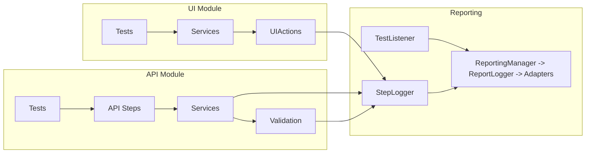
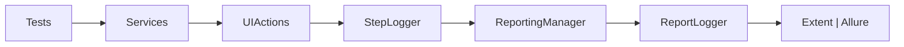
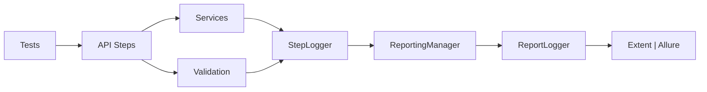
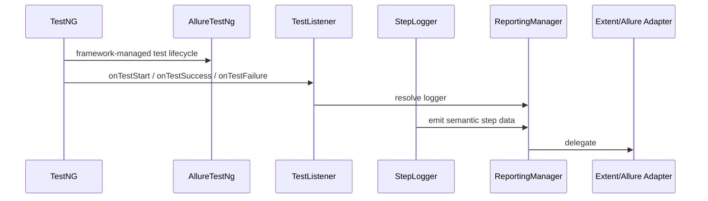

# Living Architecture (UI + API) - Canonical `v1.0`

Canonical companion to [Living_Architecture_UI_API_doc_v1_0.html](Living_Architecture_UI_API_doc_v1_0.html).

This Markdown version preserves the same architectural intent in a collapsible, README-style format for easier scanning in GitHub/GitLab. The HTML file remains the canonical visual artifact.

`[CORE]` shared reusable contracts and infrastructure  
`[UI]` guidelines exclusive to the UI framework  
`[API]` guidelines directly applicable to the API framework  
`[REPORTING]` specialized subset of CORE dedicated to reporting

Technologies: `Java 11` | `Maven` | `TestNG` | `RestAssured`  
Root package: `{framework.basePackage} = com.endava.ai`  
Unified config: `framework.properties` in `src/main/resources`

## 1) Approach

<details open>
<summary>Scope and responsibilities <code>[CORE]</code></summary>

- `[API]` guidelines directly applicable to an API framework
- `[UI]` guidelines exclusive to the UI framework
- `[CORE]` shared reusable contracts and infrastructure
- `[REPORTING]` specialized subset of CORE dedicated to reporting

Interaction model:

- `[UI]` `UIActions + WaitUtils + UIEngine`
- `[API]` `ApiClient + Services + Validations`
- unified reporting: `ReportLogger + ReportingManager + StepLogger`
- reporting engines: `Extent` and `Allure`

</details>

<details>
<summary>Canonical package structure <code>[CORE]</code></summary>

All framework components `MUST` be defined under the same `{framework.basePackage}` and within the same `src`.

- UI root package: `{framework.basePackage}.ui`
- API root package: `{framework.basePackage}.api`
- Core module: `{framework.basePackage}.core`
- Reporting module: `{framework.basePackage}.core.reporting`

<details>
<summary>Used hierarchy</summary>

`[CORE]` core module:

```text
config/
  ConfigManager.java

listener/
  TestListener.java

reporting/
  ReportingManager.java
  ReportLogger.java
  StepLogger.java
  adapters/
    AllureAdapter.java
    ExtentAdapter.java
```

</details>

</details>

## Centralized Configuration

<details open>
<summary>UI properties <code>[UI]</code></summary>

```properties
base.url=https://practicesoftwaretesting.com
## ui.engine options: selenium, playwright
ui.engine=selenium
ui.headless=false
ui.window.mode=fullscreen
ui.window.size=
ui.page.zoom.percent=60
ui.wait.timeout.seconds=5
ui.screenshots.enabled=true
ui.screenshots.on.failure.only=false
ui.screenshots.capture.final.state=true

reports.dir=target/reports
## reporting.engine options: allure, extent
reporting.engine=extent
reports.timestamp.enabled=true
reports.timestamp.format=yyyy-MM-dd_HH-mm-ss
console.details.enabled=true
```

</details>

<details open>
<summary>API properties <code>[API]</code></summary>

```properties
base.url.api=https://gorest.co.in
auth.token=
api.wait.timeout.seconds=10
api.rate.limit.max.retries=2
api.rate.limit.retry.default.delay.seconds=5
api.rate.limit.retry.max.delay.seconds=65

reports.dir=target/reports
## reporting.engine options: allure, extent
reporting.engine=extent
reports.timestamp.enabled=true
reports.timestamp.format=yyyy-MM-dd_HH-mm-ss
console.details.enabled=true
```

</details>

## 2) Architecture Diagrams `[CORE]`

<details open>
<summary>2.1 Module structure (static)</summary>



What it illustrates:

- separation of responsibilities between the UI, API, and Reporting components
- tests remain thin orchestration layers
- UI interactions, API orchestration, and reporting are routed through dedicated layers

Why it matters:

- UI, API, or reporting engines can be changed without impacting business tests
- coupling and duplication are reduced
- the framework remains predictable and contract-driven

</details>

## 3) Canonical Rules - MUST / MUST NOT `[CORE]`

<details>
<summary>3.1 Configuration and reporting integration <code>[CORE]</code></summary>

### Config

- `MUST` all framework settings be defined in `framework.properties`
- `MUST` configuration access happen exclusively through `ConfigManager`
- `MUST` there be a single `ConfigManager`, located in the core module and used by all modules
- `MUST` `ConfigManager` provide `require(key)` and `get(key, default)`

### Reporting integration

- `MUST` the framework interact with reporting exclusively through the canonical contract defined in section `3.5`
- `MUST NOT` execution layers depend on engines, adapters, or internal reporting mechanisms

</details>

<details>
<summary>3.2 UI: interactions and waits <code>[UI]</code></summary>

### UI interactions

- `MUST` all UI interactions be executed exclusively through `UIActions`
- `MUST` `UIEngine` expose only basic operations such as click, type, getText, and wait
- `MUST` the framework provide two concrete implementations of `UIEngine` (`Selenium` and `Playwright`), selectable through configuration
- `MUST` the active UI engine standardize browser size for execution and screenshots, default `2560x1440`

### Waits

- `MUST` all explicit waits be implemented exclusively through `WaitUtils`
- `MUST` the decision to apply an explicit wait be made inside `UIActions`, in an engine-aware manner
- `MUST NOT` `WaitUtils` emit FAIL directly; FAIL is controlled exclusively at the step level

### Engine-dependent wait strategy

- `MUST` `UIEngine` expose `boolean supportsAutoWait()`
- `MUST` Selenium-based engines return `false`
- `MUST` Playwright-based engines return `true`
- `MUST` `UIActions` decide explicit-wait application before interactions

```java
private static void waitIfRequired(String cssSelector) {
  if (!DriverManager.getEngine().supportsAutoWait()) {
    WaitUtils.waitForVisible(cssSelector);
  }
}
```

</details>

<details>
<summary>3.3 Validation Layer <code>[UI]</code></summary>

- `MUST` all assertions be implemented exclusively in the Validation Layer
- `MUST` validations be exposed through reusable classes
- `MAY` the Validation Layer create `Validate` steps in the report using `StepLogger`
- `MUST` a validation failure mark the test as `FAILED` without stopping execution of subsequent tests

</details>

<details>
<summary>3.4 API: services <code>[API]</code></summary>

### Test Layer

- `MUST` tests orchestrate business flows exclusively through API Steps, Factories/Builders, and Validators
- `MUST NOT` tests execute HTTP calls or perform reporting directly

### API Steps

- `MUST` API Steps orchestrate semantic business flows
- `MUST` API Steps call Services to execute HTTP calls
- `MUST` API Steps call the Validation Layer for assertions
- `MUST NOT` API Steps execute HTTP calls directly or construct payloads

### Services

- `MUST` Services define the endpoint through `basePath`
- `MUST` Services expose business methods
- `MUST NOT` Services contain assertions or validations

### HTTP Execution

- `MUST` HTTP-call execution be delegated to a reusable shared layer
- `MUST` the full URL be built as `{base.url.api} + relativePath`
- `MUST` the execution layer return the `Response` object

### Request / Response Models

- `MUST` request models be constructed exclusively through Factories or Builders
- `MUST NOT` tests or API Steps manually construct JSON payloads

### Reporting for API

- `MUST` every HTTP call be wrapped in an active semantic step
- `MUST` semantic call details (`method`, `path`, `URL`, `status`) be logged inside the active step
- `MUST` request and response payloads be logged exclusively through the canonical reporting contract
- `MUST` HTTP payloads be formatted as pretty-printed JSON before logging

### Semantics and naming for API steps

- `MUST` HTTP call steps use `{HTTP METHOD} {relativePath}`, for example `POST /users`
- `MUST` the full URL be included in details
- `MUST` validation steps use a declarative format such as `Validate: status=201`
- `MAY` validation details be logged within the step content

</details>

<details>
<summary>3.5 Canonical reporting contract <code>[CORE]</code></summary>

### Principle

- `MUST` the framework expose a single canonical mechanism for writing reporting information
- `MUST` this mechanism be accessible to `UIActions`, `Services`, and `Validation`
- `MUST` execution layers emit reporting information exclusively through `StepLogger`

### Canonical API - required methods

- `StepLogger.startStep(String title)`
- `StepLogger.logDetail(String detail)`
- `StepLogger.pass(String message)`
- `StepLogger.fail(String message)`
- `StepLogger.logCodeBlock(String content)`

### Usage rules

- `MUST` each semantic step be created explicitly through `StepLogger.startStep(...)`
- `MUST` a step be finalized exactly once through `pass(...)` or `fail(...)`
- `MUST NOT` allow a new step to start while an active step already exists
- `MUST NOT` call `logDetail(...)` or `logCodeBlock(...)` outside an active step

### Limitations

- `MUST NOT` execution layers control test start or test end

</details>

<details>
<summary>3.6 Global constraints <code>[CORE]</code></summary>

- `MUST` all framework dependencies be available at runtime
- `MUST NOT` dependencies be declared with `<scope>test</scope>`
- `MUST NOT` use method names `wait`, `notify`, `notifyAll`, `finalize`
- `MUST` there be a single `pom.xml` at the project root
- `MUST NOT` separate Maven modules be defined

</details>

## 4) Reporting (engines, contract, and internal details) `[REPORTING]`

This section groups internal reporting details for `Extent`, `Allure`, adapters, and reporting semantics.

<details>
<summary>4.1 Reporting - execution flows and lifecycle</summary>

<details>
<summary>4.1.1 UI flow -> Reporting</summary>



The flow shows how UI actions become report steps and how they are routed to the reporting engine through abstractions.

</details>

<details>
<summary>4.1.2 API flow -> Reporting</summary>



The flow illustrates how API orchestration and API validation feed a shared reporting contract.

</details>

<details>
<summary>4.1.3 Test lifecycle ownership</summary>



</details>

</details>

<details>
<summary>4.2 Reporting contract and engine responsibilities</summary>

- `MUST` reporting-engine selection be controlled exclusively by `ReportingManager` through `reporting.engine`
- `MUST` reporting adapters implement `ReportLogger`
- `MUST` reporting adapters be accessed exclusively through `ReportingManager`
- `Extent`: `startTest`, `endTest`, and `flush` are used for explicit lifecycle control
- `Allure`: lifecycle is controlled by `AllureTestNg`; `ReportLogger` lifecycle methods are effectively NO-OP
- `Allure`: listener order is mandatory (`AllureTestNg` before `TestListener`)

</details>

<details>
<summary>4.3 Step semantics and allowed consumers</summary>

Allowed execution-layer consumers:

- `UIActions`
- `Services`
- `Validation`

The Test Layer is not a valid consumer of `StepLogger`.

### Canonical step rules

- `MUST` each semantic step be explicitly started
- `MUST` `StepLogger` be the only mechanism allowed to mark a step as `FAIL`
- `MUST` each step have exactly one final result (`PASS` or `FAIL`)
- `MUST` calls to `logDetail(...)`, `pass(...)`, and `fail(...)` occur exclusively inside an active step
- `MUST` any exception occurring outside an active step produce a test-level `FAIL`, handled through `TestListener`

### Stacktrace and screenshot

- `MUST` screenshot be captured exclusively from `TestListener`
- `MUST` screenshot be captured only once per `FAIL` test, at test level

### Console logging

- `MUST` console logging be performed exclusively through `StepLogger`
- `MUST` the step result be displayed on the last line with visual status
- `MAY` details be omitted when `console.details.enabled=false`

</details>

<details>
<summary>4.4 Example step details</summary>

### UI step - details

- `locator=cssSelector`
- `value=...` for type/select
- `wait=visible/clickable` if applied explicitly

Example:

```text
> Type into element: Email
  locator=input[data-test='email']
  value=user@example.com
PASS Typed successfully
```

### API step - details

- `method=POST`
- `path=/public/v2/users`
- `url=https://.../public/v2/users`
- `status=201`

Example:

```text
> POST /public/v2/users
  url=https://gorest.co.in/public/v2/users
  request.body={...}
  response.status=201
PASS Response validated
```

</details>

<details>
<summary>4.5 Extensibility, fail-safety, and objective</summary>

### Extensibility

- `MUST` any reporting engine be integrated exclusively through an adapter implementing `ReportLogger`
- `MUST` engine selection and instantiation be controlled exclusively by `ReportingManager`

### Fail-safety

- reporting failures must not compromise the main test lifecycle
- execution layers remain insulated from engine-specific behavior

### Operations

- semantic step start
- detail logging
- pass/fail closing
- code-block payload attachment
- adapter-driven flush

### Objective

Provide a single semantic reporting contract that remains stable while concrete reporting engines can vary internally.

</details>

## 5) Test organization and requirements

<details>
<summary>5.1 UI test organization <code>[UI]</code></summary>

- target UI (config): `{base.url} = https://practicesoftwaretesting.com`
- registration page: `{base.url}/auth/register`
- mandatory navigation: `{base.url}/auth/register`
- layering: `Tests -> Services -> Pages / Validation`

<details>
<summary>Locators and test data</summary>

### Locators

Examples:

```text
button[data-test='submit']
input[placeholder='Email']
```

### Test data

- all test data `MUST` be JSON under `src/test/resources/testdata`
- unique data `MUST` be generated through `DataGenerator`

</details>

<details>
<summary>Base test ownership</summary>

- `MUST` there be a canonical base class named `BaseTestUI`
- `MUST` all UI test classes extend `BaseTestUI`
- `MUST` `BaseTestUI` declare listeners via `@Listeners`
- listener order: `AllureTestNg`, `TestListener`
- `MUST` shared initialization happen once per class through `@BeforeClass(alwaysRun = true)`

```java
@Listeners({
    AllureTestNg.class,
    TestListener.class
})
public abstract class BaseTestUI {
    // ...
}
```

</details>

</details>

<details>
<summary>5.2 API test organization <code>[API]</code></summary>

- target API (config): `{base.url.api} = https://gorest.co.in`

<details>
<summary>Canonical API flows</summary>

```text
POST   /public/v2/users -> expect 201
GET    /public/v2/users/{id} -> expect 200
PATCH  /public/v2/users/{id} -> expect 200
DELETE /public/v2/users/{id} -> expect 204
```

</details>

<details>
<summary>Auth and token handling</summary>

- `MUST` the token be defined in config through `auth.token`
- API write scenarios depend on a valid runtime token

</details>

<details>
<summary>Base test ownership</summary>

- `MUST` there be a canonical base class named `BaseTestAPI`
- `MUST` all API test classes extend `BaseTestAPI`
- `MUST` `BaseTestAPI` declare listeners via `@Listeners`
- listener order: `AllureTestNg`, `TestListener`
- `MUST` shared initialization happen once per class through `@BeforeClass(alwaysRun = true)`

```java
@Listeners({
    AllureTestNg.class,
    TestListener.class
})
public abstract class BaseTestAPI {
    // ...
}
```

</details>

</details>

## 6) Delivery artifacts

<details>
<summary>Required artifacts <code>[CORE]</code></summary>

Required project artifacts include:

- `pom.xml`
- `framework.properties`
- `README.md`
- source code under `src/main`
- tests under `src/test`
- reporting and configuration components

`README.md` `MUST` explain:

- project configuration
- execution steps
- testing approach
- reporting strategy

</details>
