# Iterative Governed Execution Atlas

Teacher memory only. Do not use this file as a package HTML template.

Primary live references:

- [Atlas HTML](./prompts/iterativ/iterative-governed-execution-atlas.html)
- [Iterative Core](./prompts/iterativ/iterative-core-standard.html)
- [Orchestration](./prompts/iterativ/prompt-evolution-orchestration-standard.html)
- [UI Frontier](./prompts/iterativ/ui-flow-discovery-and-atf-test-generation.html)
- [Reporting](./prompts/iterativ/langgraph-business-understanding-reporting-standard.html)
- [Local benchmark mirror](./html-ex/README.md)

<details open>
<summary>1) Overview - master governors and section ownership map</summary>

Owner reference: [Atlas HTML](./prompts/iterativ/iterative-governed-execution-atlas.html)

<details>
<summary>1.1 Governor Stack - who governs which lane and what each lane does not own</summary>

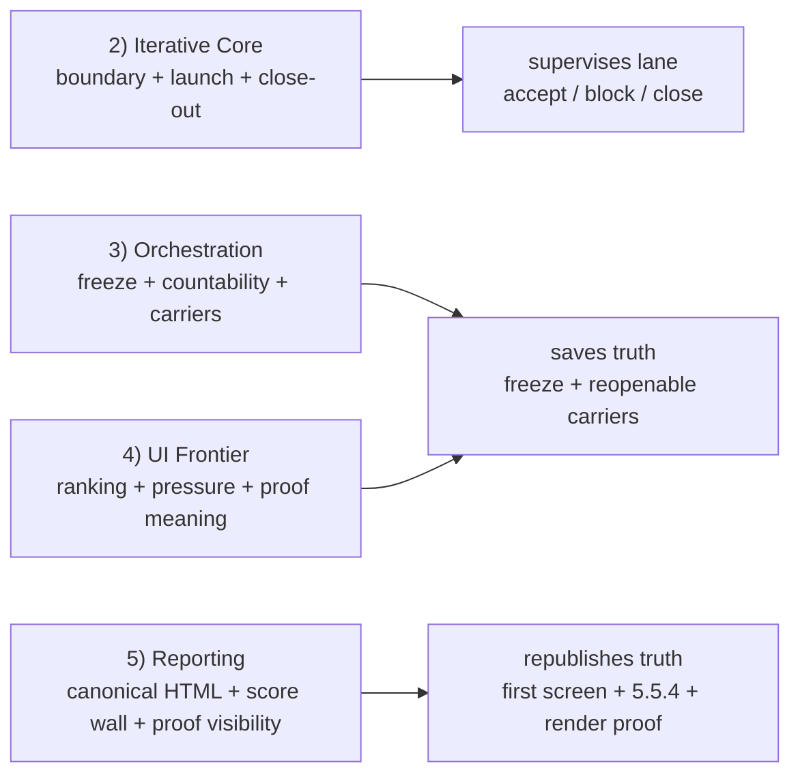

- Read order: open the family that owns the question.
- Atlas only: execution memory, not canonical package grammar.
- Do not use this file as a package HTML template.
- If a local owner standard is absent or stale, this atlas becomes routing memory only.
- Stylesheet note: atlas styling does not replace the package HTML stylesheet rules.
- More detail: [iterative-governed-execution-atlas.html](./prompts/iterativ/iterative-governed-execution-atlas.html)

</details>
</details>

<details open>
<summary>2) Iterative Core As Supervisor - what iterative-core-standard.html governs coldly</summary>

Owner reference: [Iterative Core](./prompts/iterativ/iterative-core-standard.html)

<details>
<summary>2.1 Full Lane Map - the shortest cold map of the whole execution wall</summary>

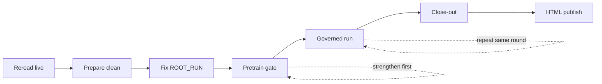

- Scope: shortest honest lane.
- Order only: reread, prepare, pretrain, run, close-out, then HTML.
- Pretrain is the only pre-code loop.
- HTML is downstream only.
- More detail: [iterative-governed-execution-atlas.html](./prompts/iterativ/iterative-governed-execution-atlas.html)

</details>

<details>
<summary>2.2 Pre-Code / Pre-Launch Wall - the exact wall before run_01 is permitted</summary>

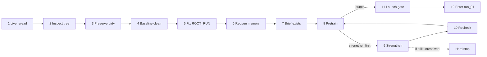

- Goal: no governed code starts too early.
- `round-pretraining-brief.md` must exist before launch talk is legal.
- `strengthen first` means save the missing artifact now, then rejudge.
- Hard stop only after strengthen still cannot close the gate coldly.
- More detail: [iterative-governed-execution-atlas.html](./prompts/iterativ/iterative-governed-execution-atlas.html)

</details>

<details>
<summary>2.3 Governed Run Loop - the repeating lane after launch is earned</summary>

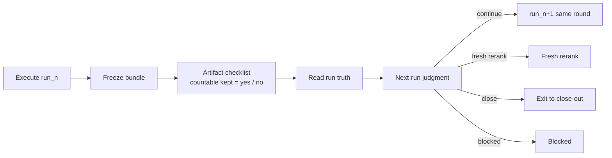

- This is the only repeating zone.
- Freeze bundle must exist before later slot judgment.
- Checklist truth publishes countability.
- Next-run judgment may continue, rerank, block, or close.
- More detail: [iterative-governed-execution-atlas.html](./prompts/iterativ/iterative-governed-execution-atlas.html)

</details>

<details>
<summary>2.4 Atomic Next-Run Lock - the binary lock that must close before any later governed slot is legal</summary>

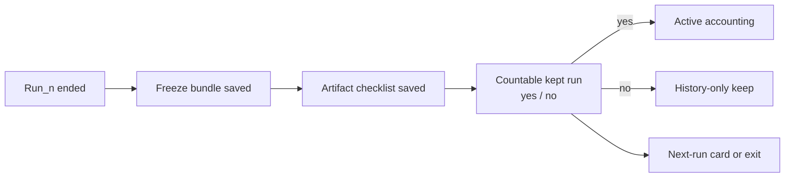

- Atomic lock: `freeze -> artifact-checklist -> countable kept = yes / no -> only then run_##+1`
- `yes` may enter accounting and score authority.
- `no` may stay in history, but not in active accounting.
- More detail: [iterative-governed-execution-atlas.html](./prompts/iterativ/iterative-governed-execution-atlas.html)

</details>

<details>
<summary>2.5 Failure Decoder - the cold decision tree when the lane does not pass cleanly</summary>

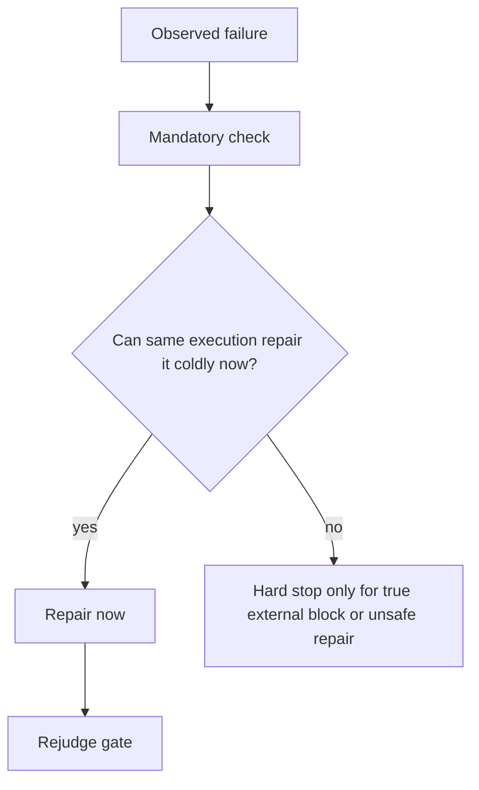

- Treat `strengthen first` as work to do now, not as a theatrical stop.
- Repair local missing artifacts in the same execution when possible.
- Missing conditional carriers are real launch defects.
- More detail: [iterative-governed-execution-atlas.html](./prompts/iterativ/iterative-governed-execution-atlas.html)

</details>
</details>

<details open>
<summary>3) Orchestration As Saved-Artifact Owner - what prompt-evolution-orchestration-standard.html owns on disk</summary>

Owner reference: [Orchestration](./prompts/iterativ/prompt-evolution-orchestration-standard.html)

<details>
<summary>3.1 Freeze Bundle - what one governed run must leave behind before it counts</summary>

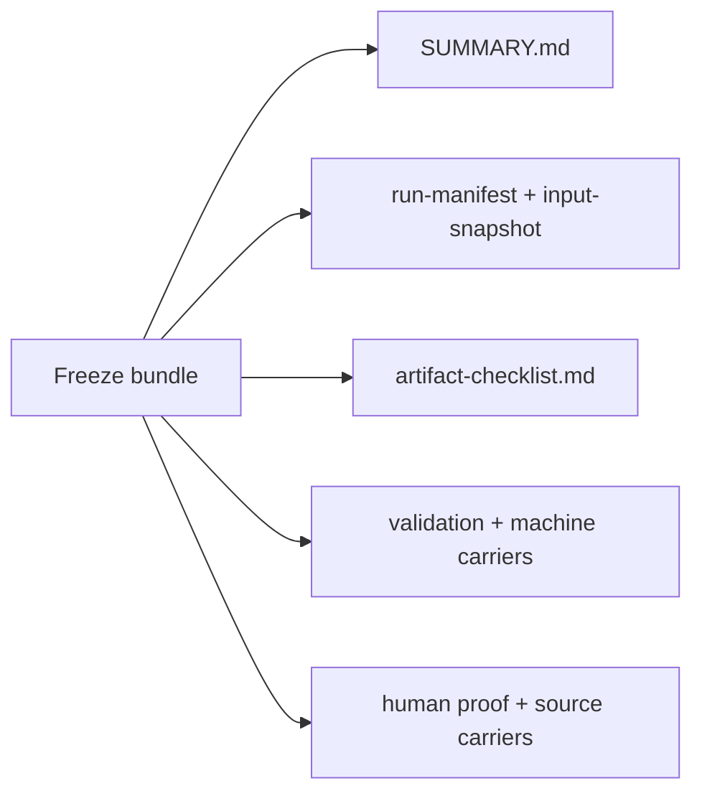

- Freeze is a bundle, not one file.
- `artifact-checklist.md` is the binary freeze owner.
- Machine XML alone is not enough; one decisive human-readable proof carrier must exist.
- More detail: [iterative-governed-execution-atlas.html](./prompts/iterativ/iterative-governed-execution-atlas.html)

</details>

<details>
<summary>3.1a Rigid Checklist Lock - freeze must become checklist truth before countability or next-run legality exists</summary>

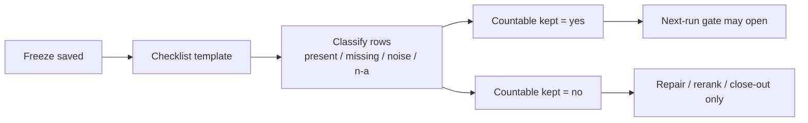

- Freeze is not enough; it must become checklist truth.
- The template is rigid.
- Only after row classification may countability be published.
- More detail: [iterative-governed-execution-atlas.html](./prompts/iterativ/iterative-governed-execution-atlas.html)

</details>

<details>
<summary>3.2 Run Truth Reading - what one kept run is allowed to prove and what it is not allowed to fake</summary>

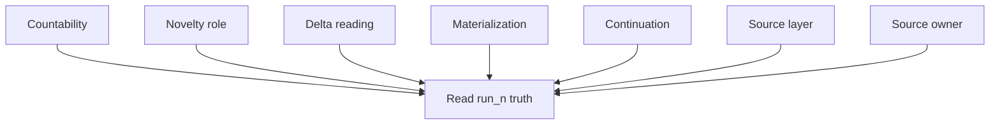

- `RUN_EXPECTED_DELTA_QUALITY` decides whether the kept run reads as verdict-moving.
- Novelty role and materialization must stay separate.
- `ROUND_TARGET_TEST_COUNT` is not a one-run pass/fail.
- One kept run may clear run-quality and still remain capped later.
- More detail: [iterative-governed-execution-atlas.html](./prompts/iterativ/iterative-governed-execution-atlas.html)

</details>

<details>
<summary>3.3 Artifact Taxonomy And Owner Chain - what must be visible, what stays memory-only, and what can be deleted</summary>

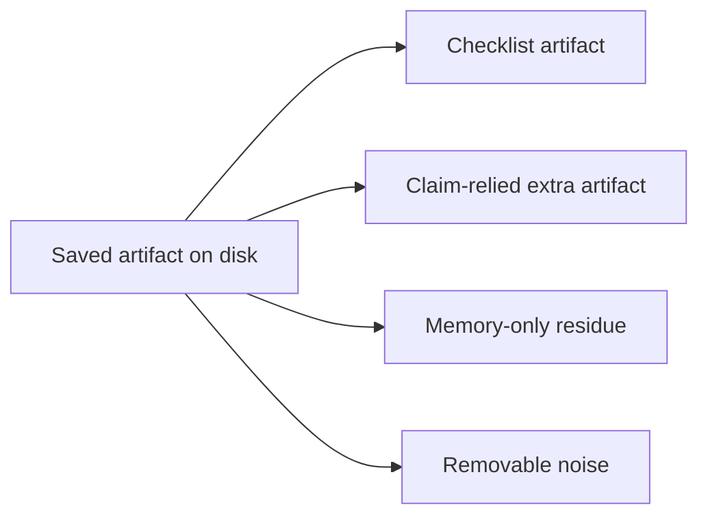

- Checklist artifacts must be `hyperlink / missing / n/a`.
- Claim-relied extra artifacts must name exact HTML owners.
- Memory-only residue stays `no`.
- Vague owners like `5.5` are invalid.
- More detail: [iterative-governed-execution-atlas.html](./prompts/iterativ/iterative-governed-execution-atlas.html)

</details>

<details>
<summary>3.4 Zero-Kept / Falsifier-Only State - what the lane is still allowed to do when nothing countable survived yet</summary>

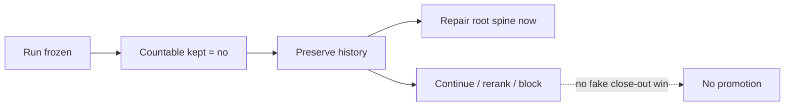

- Falsifier-only runs may still teach something.
- They must not silently power accounting or score posture.
- Root spine may need repair before any continuation claim.
- More detail: [iterative-governed-execution-atlas.html](./prompts/iterativ/iterative-governed-execution-atlas.html)

</details>

<details>
<summary>3.5 Root Spine Repair Before Continuation - when later runs are blocked until root package truth is repaired first</summary>

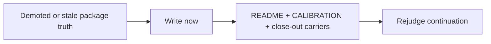

- Repair root carriers before pretending the next slot is legal.
- Do not let demoted package truth sit stale while rerank proceeds.
- More detail: [iterative-governed-execution-atlas.html](./prompts/iterativ/iterative-governed-execution-atlas.html)

</details>

<details>
<summary>3.6 Branch-Memory Update - how the branch-level README keeps active ROOT_RUN truth cold</summary>

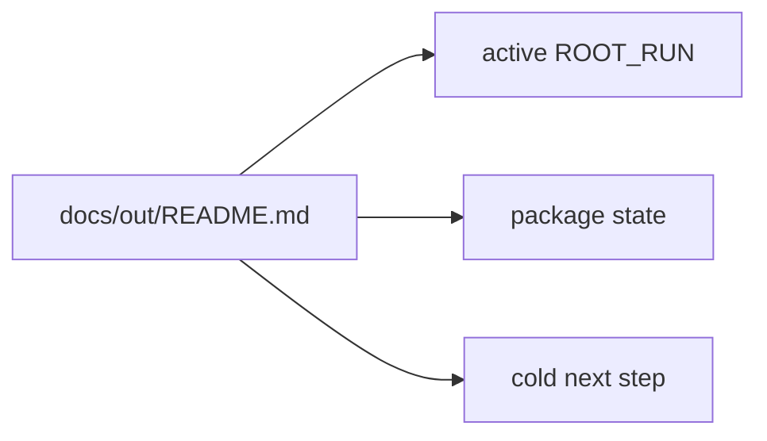

- `docs/out/README.md` is branch memory, not final HTML.
- It is reopened first; do not guess active package from folders alone.
- If branch memory materially controls relaunch, save the reopen note too.
- More detail: [iterative-governed-execution-atlas.html](./prompts/iterativ/iterative-governed-execution-atlas.html)

</details>
</details>

<details open>
<summary>4) UI Frontier And Local Branch Choice - what ui-flow-discovery-and-atf-test-generation.html decides locally</summary>

Owner reference: [UI Frontier](./prompts/iterativ/ui-flow-discovery-and-atf-test-generation.html)

<details>
<summary>4.1 Frontier Ledger To Next-Run Card - what is ranked once, what is copied forward, and when copied row becomes n/a</summary>

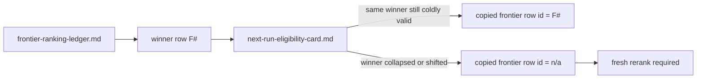

- Ledger ranks once; eligibility card does not re-rank from memory.
- `F#` is legal only while copied winner truth still holds.
- `n/a` means fresh rerank, not soft continuation.
- More detail: [iterative-governed-execution-atlas.html](./prompts/iterativ/iterative-governed-execution-atlas.html)

</details>

<details>
<summary>4.2 Next-Run Law - what continuation is allowed to do after one kept run</summary>

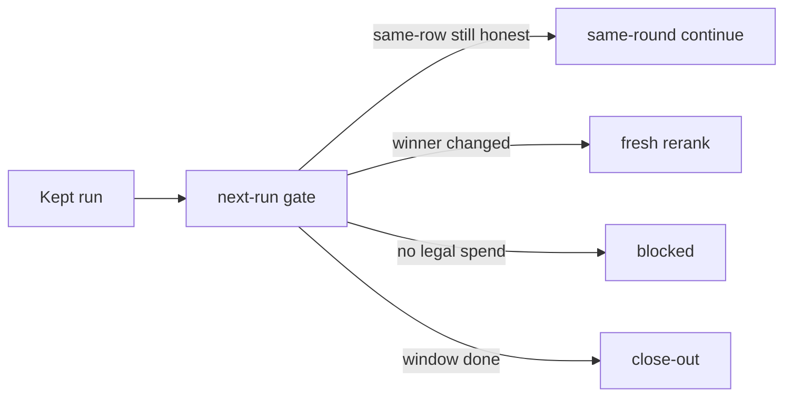

- Same-round continue is not automatic.
- Winner memory does not donate the next frontier.
- Blocked same-round does not mean exploration is exhausted.
- More detail: [iterative-governed-execution-atlas.html](./prompts/iterativ/iterative-governed-execution-atlas.html)

</details>

<details>
<summary>4.2a Same-Round Stop To Fresh-Round Restart - blocked continuation does not mean exploration is exhausted</summary>

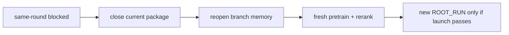

- Same-round stop and family-level exhaustion are different truths.
- Fresh-round restart still needs full prepare and pretrain.
- More detail: [iterative-governed-execution-atlas.html](./prompts/iterativ/iterative-governed-execution-atlas.html)

</details>

<details>
<summary>4.3 Proof Species And Expected Spine - API-only, UI-visible, and mixed runs do not owe the same proof bundle</summary>

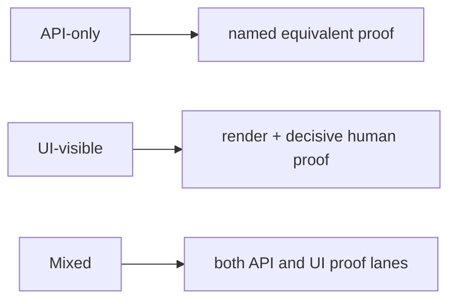

- Extent is not absolute for every species.
- Proof obligation depends on run species and claimed truth.
- More detail: [iterative-governed-execution-atlas.html](./prompts/iterativ/iterative-governed-execution-atlas.html)

</details>

<details>
<summary>4.3a Human-Readable Proof Matrix - ExtentReport yes/no is not the same question as proof carrier yes/no</summary>

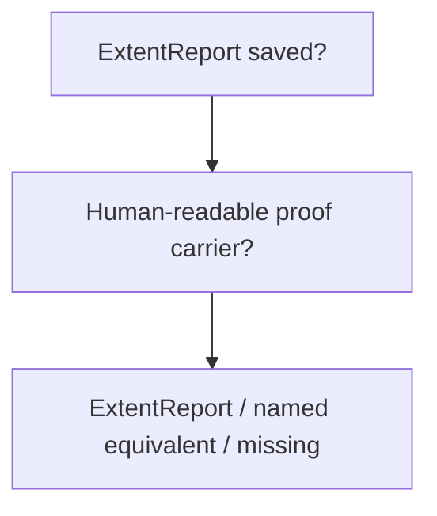

- `ExtentReport saved = no` does not automatically mean proof = missing.
- `named equivalent` is valid only when the species and claim support it.
- More detail: [iterative-governed-execution-atlas.html](./prompts/iterativ/iterative-governed-execution-atlas.html)

</details>

<details>
<summary>4.4 Sensitive False Readings - failure rules</summary>

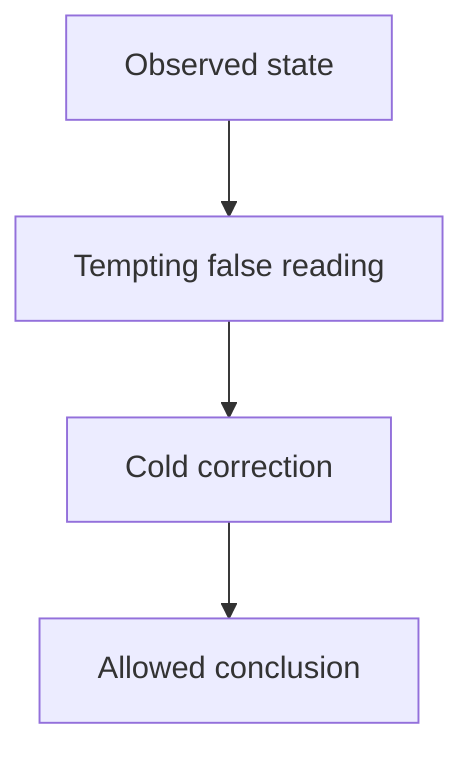

- Do not promote mid-window truth into close-out truth too early.
- One winner does not donate next-rank legitimacy.
- Strong run does not equal accounting success or yield maximization.
- More detail: [iterative-governed-execution-atlas.html](./prompts/iterativ/iterative-governed-execution-atlas.html)

</details>
</details>

<details open>
<summary>5) Reporting As Canonical Publisher - what langgraph-business-understanding-reporting-standard.html publishes downstream</summary>

Owner reference: [Reporting](./prompts/iterativ/langgraph-business-understanding-reporting-standard.html)

<details>
<summary>5.1 Truth Lanes And Accounting Split - what belongs to kept-run truth, package truth, and canonical page truth</summary>

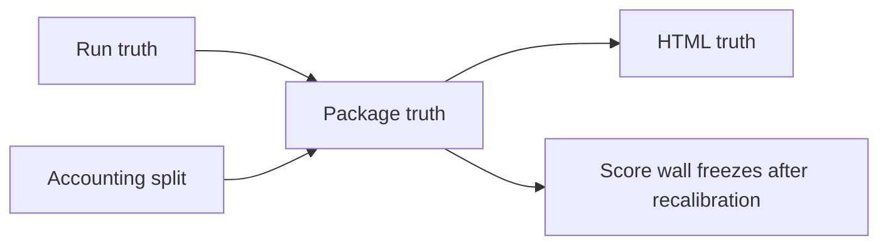

- `META_ITERATION_COUNT` is governed window cap only.
- Invalid reading: `META_ITERATION_COUNT x ROUND_TARGET_TEST_COUNT`.
- HTML republishes frozen truth; it does not recalculate it.
- More detail: [iterative-governed-execution-atlas.html](./prompts/iterativ/iterative-governed-execution-atlas.html)

</details>

<details>
<summary>5.1a Opening Family Ownership - who owns the first-screen truth inside the canonical page</summary>

```mermaid
flowchart LR
  H["Hero"] --> C["Score cards"]
  C --> A["Accounting cue"]
  A --> S["Compare strip when earned"]
```

- First screen answers what moved, why the page is not stronger, and better/worse than what.
- Do not let later sections re-answer opening questions more slowly.
- More detail: [iterative-governed-execution-atlas.html](./prompts/iterativ/iterative-governed-execution-atlas.html)

</details>

<details>
<summary>5.1b 5.5 Internal Ownership Chain - how reporting walks from visible run matrix to completeness crosswalk</summary>

```mermaid
flowchart LR
  A["5.5.1 Run matrix"] --> B["5.5.2 Evidence bands"]
  B --> C["5.5.3 Closure gates"]
  C --> D["5.5.4 Crosswalk"]
```

- 5.5.1 shows visible kept-run rows.
- 5.5.2 groups supporting evidence.
- 5.5.3 publishes closure and missing truth.
- 5.5.4 is the completeness crosswalk.
- More detail: [iterative-governed-execution-atlas.html](./prompts/iterativ/iterative-governed-execution-atlas.html)

</details>

<details>
<summary>5.1c 5.5.2a / 5.5.2b / 5.5.4 Split - source band, artifact index, and completeness map are different jobs</summary>

```mermaid
flowchart LR
  A["5.5.2a source posture"] --> QA["what source authority exists?"]
  B["5.5.2b artifact index"] --> QB["what artifacts exist and where?"]
  C["5.5.4 crosswalk"] --> QC["is every required family hyperlink / missing / n-a with exact owner?"]
```

- Source truth, inventory truth, and completeness truth are different checks.
- Do not merge them mentally.
- More detail: [iterative-governed-execution-atlas.html](./prompts/iterativ/iterative-governed-execution-atlas.html)

</details>

<details>
<summary>5.1d One Canonical Report Order - the atlas routes to one large canonical report, not to alternate report species</summary>

```mermaid
flowchart LR
  O["Opening"] --> G["Graph"]
  G --> P["Proof ownership"]
  P --> H["Standing / history"]
  H --> C["Close-out"]
  C --> R["Render / style"]
```

- One canonical large report only.
- Compression is allowed locally.
- Species drift into small or alternate reports is not allowed.
- More detail: [iterative-governed-execution-atlas.html](./prompts/iterativ/iterative-governed-execution-atlas.html)

</details>

<details>
<summary>5.1e Canonical Family Coverage And Penalty - present, absorbed, not applicable, or missing changes score posture coldly</summary>

```mermaid
flowchart LR
  F["family required"] --> S{"status"}
  S --> P["present"]
  S --> A["absorbed by"]
  S --> N["not applicable"]
  S --> M["missing"]
  M --> C["coverage incomplete = yes"]
  C --> B["Business HTML capped"]
  C --> O["Overall capped"]
  C --> R["replacement readiness = no"]
```

- Silent omission is not allowed.
- Missing family coverage hits structure truth and replacement posture.
- More detail: [iterative-governed-execution-atlas.html](./prompts/iterativ/iterative-governed-execution-atlas.html)

</details>

<details>
<summary>5.1f Comparative Strip Law - a real comparator keeps Overall cold; vague comparison does not</summary>

```mermaid
flowchart LR
  R["real exemplar link"] --> V["valid restraint"]
  L["local substitute / vague comparator"] --> W["weak restraint"]
```

- Comparator strips are restraint tools, not vanity ranking.
- Real exemplar links keep Overall colder.
- More detail: [iterative-governed-execution-atlas.html](./prompts/iterativ/iterative-governed-execution-atlas.html)

</details>

<details>
<summary>5.2 Close-Out Bundle And Publication Cascade - how package truth freezes and then becomes canonical HTML</summary>

```mermaid
flowchart LR
  P["Package close-out truth"] --> R["README + CALIBRATION + package carriers"]
  R --> H["Canonical HTML"]
  H --> V["render proof + local-link-check"]
```

- Close-out freezes package truth before HTML republishes it.
- HTML publication must stay downstream.
- More detail: [iterative-governed-execution-atlas.html](./prompts/iterativ/iterative-governed-execution-atlas.html)

</details>

<details>
<summary>5.2a Score Derivation Pipeline - how run truth and package truth become the visible four score cards</summary>

```mermaid
flowchart LR
  R["Frozen run truth"] --> P["Frozen package truth"]
  P --> C["Cap rules"]
  C --> RC["Recalibration pass"]
  RC --> W["Business / Trust / Coverage / Overall"]
```

- Visible cards freeze only after recalibration.
- Run-quality win != accounting win != closure win.
- More detail: [iterative-governed-execution-atlas.html](./prompts/iterativ/iterative-governed-execution-atlas.html)

</details>

<details>
<summary>5.2a.1 Score-Support Carrier Subflow - run score carriers feed package accounting before final recalibration</summary>

```mermaid
flowchart LR
  S["run-delta-score.md"] --> B["run-delta-baselines.md when needed"]
  B --> C["run-delta-cap-triggers.md when needed"]
  C --> Q["quality-accounting-verdict.md"]
```

- Run score carrier is mandatory.
- Baselines and cap triggers are conditional.
- Package accounting consumes these before final score wall freeze.
- More detail: [iterative-governed-execution-atlas.html](./prompts/iterativ/iterative-governed-execution-atlas.html)

</details>

<details>
<summary>5.2b Card Downgrade Order - which visible card usually drops first when a specific defect dominates</summary>

```mermaid
flowchart TD
  P["weak proof"] --> T["Trust first"]
  U["underused / weak frontier spend"] --> C["Coverage first"]
  M["opening / reporting drift"] --> B["Business HTML first"]
  O["open exploration / unresolved package truth"] --> V["Overall first"]
```

- Different defect families push different cards down first.
- Overall remains the last cold cap.
- More detail: [iterative-governed-execution-atlas.html](./prompts/iterativ/iterative-governed-execution-atlas.html)

</details>

<details>
<summary>5.2c Active Accounting Publication Shape - what the fixed first-screen accounting note must publish near the score cards</summary>

```mermaid
flowchart LR
  A["Threshold band<br/>RUN_EXPECTED_DELTA_QUALITY<br/>strongest kept clear"] --> B["Target band<br/>ROUND_TARGET_TEST_COUNT<br/>best material run + score"]
  B --> C["Publication band<br/>x / target + target met<br/>one fixed note near cards"]
```

- The note sits beside or just below the cards.
- Publish one fixed shape, not scattered fragments.
- One new test does not mean accounting success.
- More detail: [iterative-governed-execution-atlas.html](./prompts/iterativ/iterative-governed-execution-atlas.html)

</details>

<details>
<summary>5.2d Yield Triad Split - same-round exhaustion, governed yield, and application exploration are different truths</summary>

```mermaid
flowchart LR
  L["Local window exhausted"] -->|not automatic| G["Governed yield maximized"]
  G -->|not automatic| A["Application exhausted"]
```

- Same-round closure does not prove good slot spending.
- Good slot spending does not prove application opportunity is consumed.
- More detail: [iterative-governed-execution-atlas.html](./prompts/iterativ/iterative-governed-execution-atlas.html)

</details>

<details>
<summary>5.2e Extra Artifact Claim Law - claim-relied extras need named HTML owners; memory-only extras do not</summary>

```mermaid
flowchart LR
  X["extra artifact"] --> Q{"carries published claim?"}
  Q -->|yes| Y["named HTML owner required"]
  Q -->|no| N["n-a allowed"]
```

- `yes` only when final HTML truly leans on the artifact.
- `named HTML owner` must be exact section + anchor.
- Memory-only extras stay outside main claim chain.
- More detail: [iterative-governed-execution-atlas.html](./prompts/iterativ/iterative-governed-execution-atlas.html)

</details>

<details>
<summary>5.3 Publication Proof Pair - the last publication checks after the canonical page exists</summary>

```mermaid
flowchart LR
  H["Canonical HTML"] --> R["canonical-render-check.png"]
  H --> L["local-link-check.txt"]
  R --> P["published render proof"]
  L --> P
```

- Render proof and local-link-check are the last publication pair.
- They prove publication quality, not upstream truth.
- More detail: [iterative-governed-execution-atlas.html](./prompts/iterativ/iterative-governed-execution-atlas.html)

</details>
</details>
