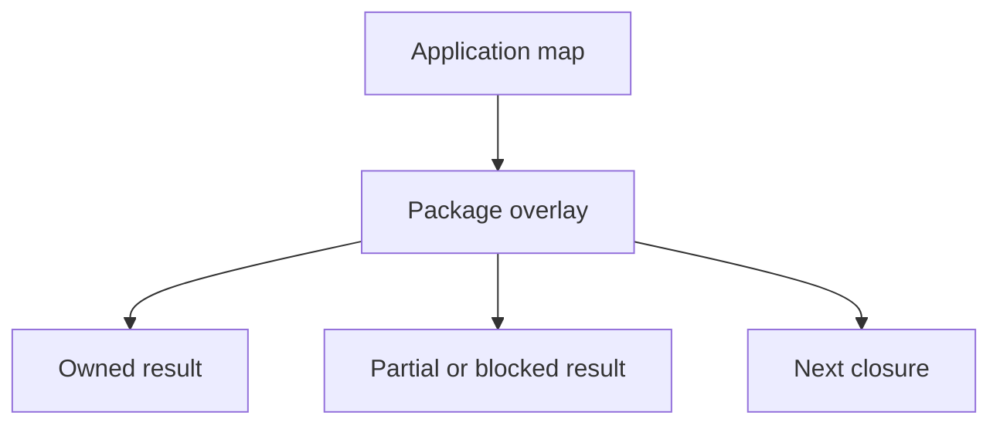
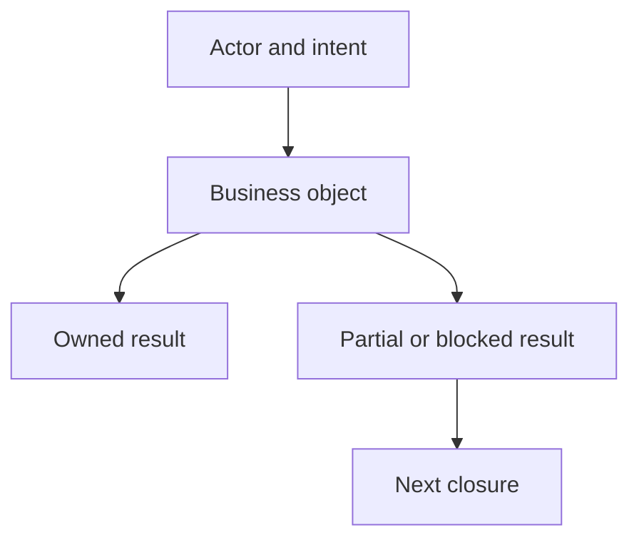

<!-- Generated from ../html_EN/business-flow-graph-rubric.html. Keep source of truth in html_EN. -->
<!-- Source stylesheet: [shared-report-reference.css](../../shared-report-reference.css) -->

# Business Flow Graph Rubric `APP MAP` `OVERLAY` `NODE` `CLOSURE`

- Explains only the drawing and validation of `Business Flow Graph`.
- `reporting.html` remains the owner of the final page.
- The reusable graph shape lives here.

## Overview

| Badge | Read here |
| --- | --- |
| `APP MAP` | the real application: lanes, actors, intents, business objects |
| `OVERLAY` | what the package touched: owned, partial, blocked, fresh-round-only |
| `NODE` | actor -> intent -> business object -> result |
| `LEGEND` | test details, run id, repair, diff, Extent, and procedural jargon |
| `CLOSURE` | the hard object or real rupture left for the next round |
| `INVALID` | the graph becomes a package journal, technical suite, or run list |

<!-- /table -->

| Category | Scope |
| --- | --- |
| Owner | `the real application` `business map` |
| Uses | `macro-map` `overlay` `closure` |
| Does not produce | `final report` `proof mapping` `score` |
| Do not put in nodes | `run ids` `locators` `repair trail` |

<!-- /table -->

The application is the map. The package is the overlay. If the overlay becomes the map, the graph must be redrawn.

Micro-example of a good node

| Field | Good node | Bad node |
| --- | --- | --- |
| actor | authenticated customer | run_03 |
| intent | reopens post-purchase memory | checks a new helper |
| business object | order row / invoice row | selector / test class |
| result | payment success owned; order history blocked | green Extent result |

<!-- /table -->

Minimum contract — map, overlay, closure

| Block | Rule |
| --- | --- |
| layer 1 | application macro-map, including relevant untouched areas |
| layer 2 | package overlay: what was touched, owned, partial, blocked |
| layer 3 | `next closure pressure`: which hard object or real rupture remains open |
| nodes | short title + at most one short context line |
| mandatory micro-template | `actor -> intent -> business object -> result` |
| legend | collapsed, immediately under the subgraph; move test jargon and procedural detail there |
| default state | in the final report all main sections are collapsible; the slot `4. Business Flow Graph` remains the only one open by default |

<!-- /table -->

| Binary test | Answers |
| --- | --- |
| application map | what exists in the product, including what the package did not touch |
| package overlay | what the package touched, without becoming the main map |

<!-- /table -->

### 1. Canonical LangGraph `APP MAP` — macro-map -> overlay -> closure

<!-- diagram-readable-table -->
| Graph layer | Answers | Invalid if |
| --- | --- | --- |
| Macro-map application | real product lanes, actors, and business objects | it starts from runs, tests, or helper classes |
| Package overlay | what this package touched on top of the application map | the overlay becomes the whole map |
| Owned / countable | business objects cold-closed by proof | green execution replaces business truth |
| Partial / blocked | real ruptures, support, and limits | blockers are hidden or softened |
| Next closure | the hard object that remains open | the graph ends with vague "more testing" |
<!-- /table -->

Short formula:

application macro-map -> package overlay -> next closure pressure.

### 1.1 Reusable Mermaid micro-template — aligned with html-ex and shared CSS

- The template is a starting point, not copied business.
- The visual style must remain compatible with `shared-report-reference.css`.
- Shape calibration uses the current examples from `HTML_EX_LIBRARY_ROOT` and `HTML_EX_LIBRARY_README`.

<!-- diagram-readable-table -->
| Template slot | Replace with | Keep out |
| --- | --- | --- |
| Actor + intent | real actor and product intent | run id, test class, helper name |
| Business object | order, invoice, message, profile, cart, comparison | selector, Java method, repair step |
| Owned | proven and countable result | score or green report as a substitute |
| Partial / blocked | real rupture or limit | cosmetic failure language |
| Next closure | next hard business object | vague plan |
<!-- /table -->

| Template slot | Replace with | Do not put here |
| --- | --- | --- |
| Actor + intent | real actor + product intent | run id, test class, helper |
| Business object | order, invoice, message, profile, cart, comparison etc. | selector, Java method, repair step |
| Owned / Partial / Blocked | the package cold result | score, green Extent, green XML as final result |
| Next closure | the remaining hard object or next rupture | vague plan or "we test more" |

<!-- /table -->

2. Minimum rubric `NODE` — what to verify before publishing

| Rubric | Must be visible | Invalidates |
| --- | --- | --- |
| application map | real product macro-zones | the graph starts directly from runs or technical families |
| package overlay | what this package changed over the map | the overlay becomes the main map |
| node template | actor -> intent -> business object -> result owned/partial/blocked | the node cannot be read as a real business object |
| business object | actor, intent, object, result | nodes with helper, locator, class name, repair |
| closure pressure | heavy object or remaining real rupture | the graph stops without next truth |
| legend discipline | procedural detail stays below, collapsed | essay inside nodes or a legend that duplicates the whole graph |

<!-- /table -->

| Mandatory micro-template | Question | Good example |
| --- | --- | --- |
| Actor | who has the intent? | `Customer` |
| Intent | what product result do they seek? | `wants post-purchase memory` |
| Object business | what real entity must exist? | `order row / invoice row / message row` |
| Result | what remains after proof? | `Orders shell partial; order row missing` |

<!-- /table -->

- The node must read as actor -> intent -> business object -> result.
- If it does not work, move the detail into the legend/proof mapping.
- If it still does not work, redraw the node.

3. Good vs bad `NODE` — very short examples

| Type | Good | Bad |
| --- | --- | --- |
| node name | `Orders history absent after payment success` | `run_03 invoice fix` |
| overlay | `Owned: Messages thread visible` | `Extent ok + xml ok + diff ok` |
| closure | `Next: order row persistent after relogin` | `Check again in run_05` |
| commerce | `Payment success -> order history blocked` | `Checkout tests green` |
| support | `Contact message submitted -> thread/reply ownership partial` | `Support form run_02` |
| account | `Profile setting changed -> persistence after relogin owned` | `Account helper fixed` |

<!-- /table -->

4. Bad smells `INVALID` — when cooling down the graph

- If the reader remembers `run_03`, `repair`, `reentry` before the business lane, the graph is too procedural.
- If the application macro-map fits in a corner while the overlay occupies everything, the report is package-first.
- If the nodes already contain proof, diff, and explanation, the graph is trying to do too much.
- If the legend repeats the whole graph, it is no longer a legend; it is a poorly disguised essay.

