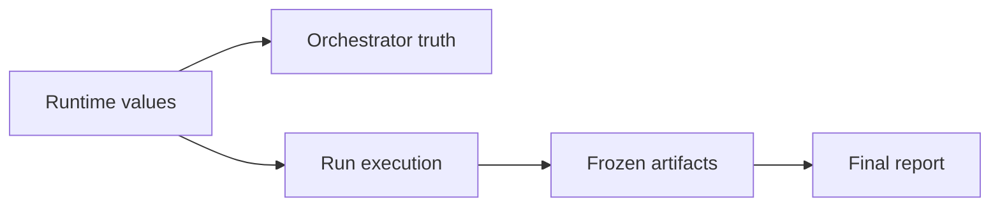

<!-- Generated from ../html_EN/execute-and-understand-run.html. Keep source of truth in html_EN. -->
<!-- Source stylesheet: [shared-report-reference.css](../../shared-report-reference.css) -->

# Execute and Understand Run `RUN` `ARTIFACTS` `PROOF` `STATE`

- Runs the governed slot.
- Produces tests.
- Saves diff, proof, and state.
- Explains the understanding gained.
- The orchestrator decides the legality of the next move; execution works the approved slot.


## Overview

| Badge | Read here |
| --- | --- |
| `RUN` | slot approved by the orchestrator; execution and explanation happen here |
| `ARTIFACTS` | diff, proof, XML, Extent, state, and feedback saved on disk |
| `PROOF` | claim tied to reopenable proof, not just narrative text |
| `STATE` | `run-state.json`, `package-state.json`, `execution-gate-card.md` |
| `ACCOUNTING` | countability, active target, kept / partial / blocked |
| `HANDOFF` | cold memory for the next agent and for reporting |

<!-- /table -->

| Category | Scope |
| --- | --- |
| Owner | `run fixation` `artifacts` `state` |
| Uses | `approved slot` `material from wrapper` `active runtime` `local proof` `diff` |
| Produces | `package memory` `state files` `reporting handoff` |
| Does not produce | `package legality` `UI frontier` `report layout` |

<!-- /table -->

<details>
<summary>Minimum contract</summary>

| Runtime | active values are read live and become the law of the current package |
| --- | --- |
| Tests | `ROUND_TARGET_TEST_COUNT` requires countable tests: business-distinct, auditable, proof-supported |
| Runs | `META_ITERATION_COUNT` requires fully judged, cold-fixed, and explained runs |
| Separation | the two counters do not compensate for each other and do not mix |

<!-- /table -->
</details>

<details>
<summary>Common Runtime Reference — runtime, targets, diffs, state files</summary>

| Topic | What it fixes | Action here | Artifact |
| --- | --- | --- | --- |
| `agent-runtime.properties` | active values and common paths | reopen live; do not redefine locally | `execution-gate-card.md` |
| UI wrapper | specialized UI material of the slot | turn it into canonical fixation without moving the UI owner here | `ui-business-frontier-adapter.html` |
| `RUN_EXPECTED_DELTA_QUALITY` | minimum threshold for a kept run | explain kept / partial / below threshold | `score-support.md` + `run-state.json` |
| `ROUND_TARGET_TEST_COUNT` | active target of good tests per run | produce, group, count, and explain `x / target` | `run-state.json` + `quality-accounting-verdict.md` |
| `META_ITERATION_COUNT` | active target of runs per package | judge and cold-fix each slot | `package-state.json` + `execution-gate-card.md` |
| run diff | small mutation of the claim | save per run | `thin-no-index.diff` |
| root diff | the compiled package mutation | compile at package level | `root-source-thin-no-index.diff` |
| carrier | support, not primary truth | write only when the diff is not enough | optional `source-delta-carrier.md` |
| state files | the cold state of the run and package | write the state; reporting reads it | `run-state.json` + `package-state.json` + `execution-gate-card.md` |

<!-- /table -->
</details>

<details>
<summary>1. Execution boundary — artifact law, not launch law</summary>

| Owns | Does not own |
| --- | --- |
| artifact inventory<br>cold package fixation<br>source diff-first truth<br>proof carriers<br>learning MDs<br>ready-for-report links | frontier legality<br>allowed number of runs<br>same-package continuation<br>final report layout |

<!-- /table -->

- The agent freely chooses implementation, proofs, and auxiliary notes.
- Execution requires proof and lessons saved cold on disk.
- Under-target is explained in `quality-accounting-verdict.md` and `package-close-out.md`.
- The orchestrator verifies next-move legality; execution does not launch itself.
</details>

## 2. Flows and diagrams — artifact band

<details>
<summary>2.1 Quick reading map — short orientation</summary>

| If you ask | Open | You learn cold |
| --- | --- | --- |
| who fixes and who publishes? | `2.2` | runtime -> orchestrator -> execution -> reporting split |
| what must a complete run do? | `2.3` | reopen, pretrain, execute, cold fixation, handoff |
| which state files make execution verifiable? | `2.3.1` | `run-state.json`, `package-state.json`, `execution-gate-card.md` |
| when do I group multiple tests in the same run? | `2.4` | grouping rule on functional anchor |
| how do artifacts become cold-reopenable? | `2.5` | diff chain -> proof -> learning -> handoff |

<!-- /table -->

- `2.2` = owners
- `2.3` = one-run cycle
- `2.5` = claim -> diff -> proof -> feedback
</details>

### 2.2 Runtime -> orchestrator -> execution -> reporting split — who fixes, who decides, who publishes

<!-- diagram-readable-table -->
| Owner / stage | Controls | Execution must preserve |
| --- | --- | --- |
| `agent-runtime.properties` | thresholds, targets, paths, libraries | active values read live |
| Orchestrator | legality and continuation | no local override |
| Execute | production, fixation, explanation | diff, proof, state, lesson |
| Reporting | publication of frozen verdict | no rejudging |
| Final HTML | navigable business proof | links to frozen artifacts |
<!-- /table -->



<details>
<summary>Legend</summary>

- Runtime fixes the common configuration; it does not decide legality or publication by itself.
- The orchestrator decides whether the next slot is legal.
- Execution produces artifacts, explains progress, and cold-fixes the package.
- Reporting only publishes the already fixed truth.
</details>

### 2.3 Single run cycle — what each run must do

<!-- diagram-readable-table -->
| Run step | What happens | Required output |
| --- | --- | --- |
| Reopen | history, state, and feedback are reread | current context |
| Pretrain | frontier is recalibrated | cold run intent |
| Execute | one governed slot is worked | code/test/support delta |
| Fix | diff, proof, XML, Extent, and state are saved | reopenable run truth |
| Learn + hand off | feedback and report links are written | memory for next owner |
<!-- /table -->


<details>
<summary>What must stay in mind</summary>

- The run must leave reopenable proof: diff, proof, state, and lesson.
- What is not saved on disk cannot be safely used by the next agent.
- Without diff, proof, and run state, cold fixation is not complete.
- A run explains the active target or publishes a defect / severe blocker.
- Decisive learning must be saved on disk, not left in chat.
</details>

<details>
<summary>2.3.1 Mandatory Artifact Spine `STATE` — minimum verifiable state</summary>

| Artifact | Owner | When it is written | Missing it blocks |
| --- | --- | --- | --- |
| `run-state.json` | execute | at cold fixation of the run | tests produced, proof, and kept status per slot |
| `package-state.json` | execute | on each recompilation of package truth | runs consumed, breadth verdict, and cold handoff |
| `execution-gate-card.md` | execute writes, orchestrator verifies, reporting reads | after aggregated package fixation | cold handoff to reporting |

<!-- /table -->

| File | Canonical fields | Short enums |
| --- | --- | --- |
| `runs/run_##/review/run-state.json` | `run_id`, `tests_target`, `tests_produced`, `target_status`, `delta_quality_status`, `run_diff`, `carrier`, `proof_ui`, `proof_machine`, `kept_status`, `blocker_status` | `met / under_target / blocked / missing`, `pass / fail / n-a`, `yes / no / partial` |
| `review/package-state.json` | `runs_target`, `runs_consumed`, `run_tests_target`, `root_diff`, `winner_macro_lane`, `breadth_verdict`, `same_package_legal`, `fresh_root_run_legal`, `report_status`, `render_status`, `link_audit_status` | `broad / partial / narrow`, `yes / no`, `ready / partial / blocked / missing`, `fresh / stale / missing` |
| `review/execution-gate-card.md` | aggregate header + per-run vector: `run_id`, `tests_produced`, `run_diff`, `proof`, `status` | `yes / no / partial / stale / missing`, `met / under_target / blocked` |

<!-- /table -->

```text
{

  "run_id": "run_03",

  "tests_target": "ROUND_TARGET_TEST_COUNT",

  "tests_produced": 5,

  "target_status": "met",

  "delta_quality_status": "pass",

  "run_diff": "runs/run_03/review/thin-no-index.diff",

  "carrier": "no",

  "proof_ui": "yes",

  "proof_machine": "yes",

  "kept_status": "yes",

  "blocker_status": "no"

}


{

  "runs_target": "META_ITERATION_COUNT",

  "runs_consumed": 5,

  "run_tests_target": "ROUND_TARGET_TEST_COUNT",

  "root_diff": "review/root-source-thin-no-index.diff",

  "winner_macro_lane": "orders-history",

  "breadth_verdict": "partial",

  "same_package_legal": "no",

  "fresh_root_run_legal": "yes",

  "report_status": "ready",

  "render_status": "fresh",

  "link_audit_status": "yes"

}
```

- The orchestrator defines the cold checks.
- Execution writes the files.
- Reporting only reads them.
- They do not replace the README, diff, or final report.
- Blocks defending weak execution through long prose.
</details>

<details>
<summary>2.4 Grouping rule inside the same run — when an area deserves more tests</summary>

| If you reached this point | You judge | Good form |
| --- | --- | --- |
| page / state / functionality with distinct business behaviors | can the same anchor close the active target without a mechanical sweep? | group related tests in the same run |
| anchor that cannot support the active target | real blocker or wrong selected frontier? | publish procedural defect / severe blocker and rerank |
| area with another business identity or another proof | does separation help clarity, isolation, or rerank? | split only if the new run can close the active target |

<!-- /table -->

<details>
<summary>Legend</summary>

- Good example: same area `favorites` can produce in the same run empty-state, persistence and collection behavior, if all come from the same functional anchor.
- Bad example: five close variants of the same click or same blocker only to inflate the number.
- Good grouping is based on functionality and business truth, not implementation convenience.
- At the end of each run: state whether the active target was closed.
- If not: verdict is defect or blocker sever.
</details>
</details>

<details>
<summary>2.4.1 Execution details — before / during / after the run</summary>

| Stage | Cold checklist | Do not accept |
| --- | --- | --- |
| Before | reopen the selected pretraining, relevant artifacts, feedback, and runs that change the frontier | execution from memory or mechanically copied benchmark |
| During | pursue new business, close the active target per run, group related tests on the same functional anchor | hidden sub-target through prose, helper-only, mechanical variants |
| After | save diff, proof, XML/Extent, state, feedback, and cold accounting | lessons left only in chat or proof without a reopenable link |

<!-- /table -->

The run closes the active target or publishes a defect / severe blocker with rerank.
</details>

<details>
<summary>2.5 Artifact chain — claim -> diff -> proof -> feedback</summary>

- `2.3.1 Mandatory Artifact Spine` = the contract.
- `2.5` = reading order.
- Do not add new artifacts.

<details>
<summary>Run Fixation Card</summary>

| Field | Short answer | Link cold |
| --- | --- | --- |
| claim | published business truth | `SUMMARY.md` |
| delta | what changed versus the previous state | `score-support.md` |
| diff | small mutation of the run | `thin-no-index.diff` |
| proof | execution confirmation | `Extent/XML/command-result` |
| state | tests produced, kept, blocker | `run-state.json` |
| feedback | the lesson for next agent | `*.md` decisiv |

<!-- /table -->
</details>

| Step | Question | You read |
| --- | --- | --- |
| claim | what business truth do you publish? | short verdict of the run |
| diff | what mutation supports the claim? | run diff for the claim; root diff for the package synthesis |
| proof | what does execution confirm? | Extent, XML or command result |
| feedback | what does the next agent learn? | the decisive markdown note, if it changes reranking |

<!-- /table -->
</details>

<details>
<summary>3. Minimum package skeleton — small, extensible spine</summary>

```text
<timestamp>/

  README.md

  CALIBRATION.md

  manifests/package-manifest.md

  prompt/input-snapshot.md


  analysis/

    langgraph-business-understanding.html

    shared-report-reference.css

    canonical-render-check.png


  review/

    frozen-package-inventory.md

    local-link-check.txt

    quality-accounting-verdict.md

    next-run-eligibility-card.md

    package-close-out.md

    frontier-ranking-ledger.md                  (when there is competition between frontiers)

    round-pretraining-brief.md                  (fresh ROOT_RUN; same-package only if rerank changes the winner)

    *.md                                        (helper learning carriers decisive)


  runs/run_##/

    SUMMARY.md

    manifests/run-manifest.md

    prompt/input-snapshot.md

    review/artifact-checklist.md

    review/score-support.md

    review/thin-no-index.diff                   (mandatory when the run changed source/test)

    review/source-delta-carrier.md              (mandatory when the diff requires interpretation or selection)

    review/*.md                                 (feedback / blocker / repair / learning)

    validation/command-output.txt

    validation/command-result.md

    validation/testng-results.xml or TEST-*.xml

    validation/reports/ExtentReport_*.html      (execution report and reopenable proof)
```

- Minimum does not mean low value.
- Each mandatory file has a clear role.
- Each decisive file must be linked from the report.

- Run with claim + changed code/test => requires `runs/run_##/review/thin-no-index.diff`.
- Package with multiple mutations => requires `review/root-source-thin-no-index.diff`.
- Without a relevant diff, history is not fully fixed.

<details>
<summary>3.1 Execution Gate Card `STATE` — binary package summary</summary>

```text
execution-gate-card.md

runtime read = yes / no

memory read = yes / no

runs consumed = n / META_ITERATION_COUNT

tests produced = x / ROUND_TARGET_TEST_COUNT

root diff saved = yes / no

run_01 = tests:5 | diff:yes | proof:yes | status:met

run_02 = tests:5 | diff:yes | proof:partial | status:under_target

run_03 = tests:0 | diff:no | proof:no | status:blocked

business graph ready = yes / no

render proof = yes / no / stale

link audit = yes / no

ready for report handoff = yes / no
```

- Card scurt and binar.
- Header = aggregated package state.
- Per-run vector = target, diff, proof, status.
- Missing diff/proof remains immediately visible.
</details>
</details>

<details>
<summary>4. Artifact taxonomy — always / conditional / support</summary>

- Mandatory Artifact Spine = the contract.
- Taxonomy = artifact severity.
- Do not move ownership.

| Level | Enters here | Cold rule |
| --- | --- | --- |
| always | relevant diff, relevant proof, state files, close-out | without them, the run or package is not fully fixed |
| conditional | `source-delta-carrier.md`, blocker/repair/frontier MD, specialized subsection | becomes mandatory when it changes the claim, interpretation, or rerank |
| support | short notes, local explanations, auxiliary context | keep only if they help cold reopening |

<!-- /table -->

- Do not save artifacts as decoration.
- Keep only truth, necessary interpretation, or real support.
- If it does not help the next agent, it does not enter cold fixation.
</details>

<details>
<summary>5. Diff-first rule for evolution `PROOF` — git diff explains iterative evolution</summary>

| If | You save | Role |
| --- | --- | --- |
| a single run changed the published claim | `runs/run_##/review/thin-no-index.diff` | small mutation of the run |
| multiple runs changed the package | `review/root-source-thin-no-index.diff` | the compiled package mutation |
| the diff alone does not clearly explain the claim | `source-delta-carrier.md` | interpretation support, not primary truth |

<!-- /table -->

```text
per run

  runs/run_##/review/thin-no-index.diff = small truth of the run claim

  runs/run_##/review/source-delta-carrier.md = support only if the diff is not enough

  SUMMARY.md = 1-3 lines about the historical mutation of the run


per package

  review/root-source-thin-no-index.diff = the compiled package mutation

  the report uses run diff for the small claim and root diff for the large synthesis
```

- The diff is the primary truth of evolution.
- File snapshots are support.
- Agent explanations are support.

- `source-delta-carrier.md` explains the selection or meaning of the diff.
- If the diff is missing, the carrier does not save the claim.

- `SUMMARY.md`: 1-3 lines per run.
- State the historical mutation versus the previous frontier.
- The diff remains the primary truth.
- The summary only makes it quick to reopen.
</details>

<details>
<summary>6. Extent as execution report `PROOF` — steps, status, screenshots when they exist</summary>

| Case | What is required | Impact if missing |
| --- | --- | --- |
| run kept / proof-bearing | `ExtentReport_*.html` directly reopenable, when it exists for that run | trust drops or the claim becomes only partially auditable |
| UI or flow vizual | Extent with steps, screenshots, or visible anchors | visual proof missing from the published chain |
| failure / blocker | Extent, XML, or command output with relevant failure | the blocker remains opinion |
| final report | link direct in Run Audit Strip and Artifact Index | report incomplet |

<!-- /table -->

- Extent not is only UI.
- For UI: steps and images.
- For execution: reopenable run report.
- Rol: sustine claim-uri proof-bearing.
</details>

<details>
<summary>7. Feedback constructive per run `HANDOFF` — maximum self-learning</summary>

| Tip feedback | File recomandat | Continut |
| --- | --- | --- |
| business learning | `business-understanding.md` | what business became clearer |
| frontier decision | `frontier-decision.md` | why the branch was chosen or pivoted |
| blocker | `blocker-analysis.md` | what blocheaza proof and what input missing |
| repair | `repair-analysis.md` | what support was repaired and what it unlocks |
| lesson | `lesson-learned.md` | a short lesson for the next agent |

<!-- /table -->

- Do not publish every score.
- Publish every score that influences the verdict.
- Everything that influences the verdict must be linked from the report.
</details>

<details>
<summary>8. Rigid minimum templates `ACCOUNTING` — few, but firm</summary>

```text
artifact-checklist.md

run frozen = yes / no

business claim settled = yes / no

thin-no-index.diff saved = yes / no / n/a

if no, reason = ...

source-delta-carrier required = yes / no

if yes, why = ...

run diff linked from SUMMARY/report = yes / no

ExtentReport saved = yes / no / n/a

machine result carrier saved = yes / no

decisive learning md saved = yes / no

countable kept run = yes / no

missing mandatory artifact = yes / no

notes = short only


quality-accounting-verdict.md

ROUND_TARGET_TEST_COUNT numeric = x / target

accounting target met = yes / no

business breadth verdict = broad / partial / narrow

how many good tests this run produced = ...

why these tests belong together in the same run = ...

why this run stayed below configured ambition if it did = ...

why countable = ...

why breadth is still narrow if needed = ...

what next frontier must add = ...


lesson-learned.md

what changed = ...

what was learned = ...

what should not be repeated = ...

what next run should use = ...

links = ...


frontier-decision.md

candidate frontier = ...

why it is new business = ...

why it beats alternatives = ...

required proof = ...

fallback / blocker = ...
```
</details>

