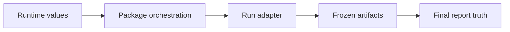
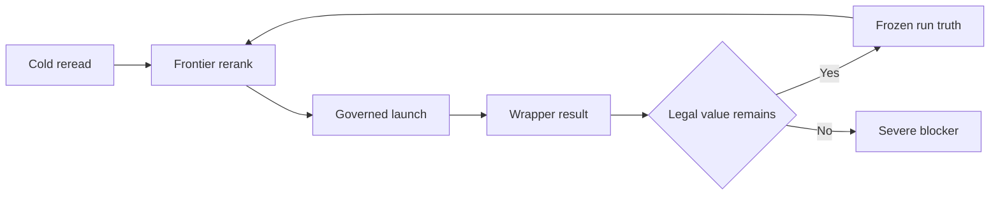
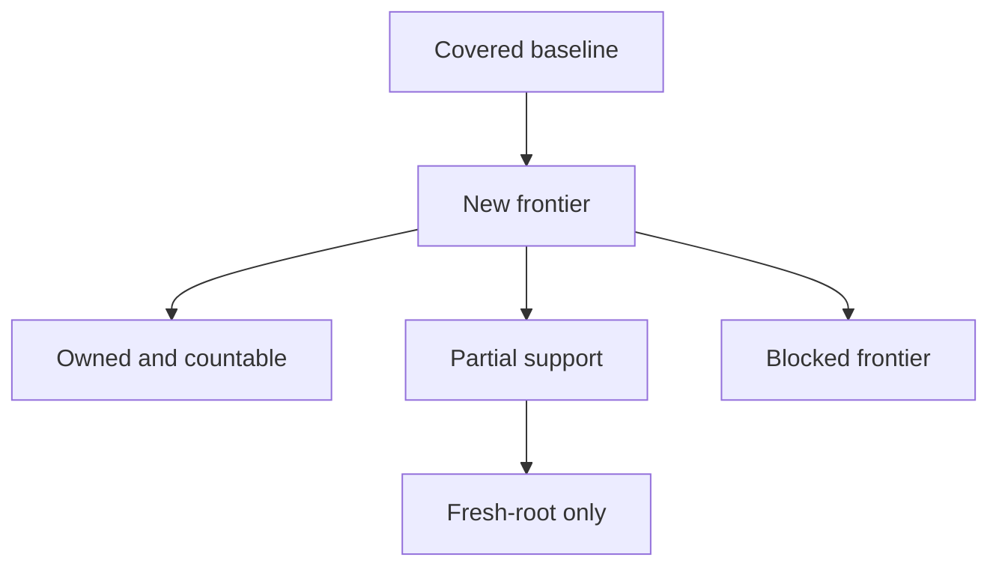
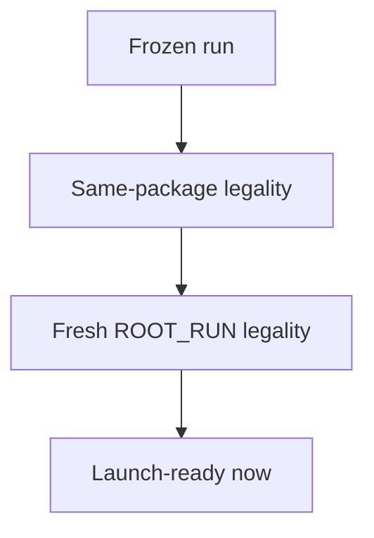
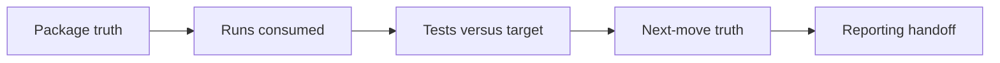

<!-- Generated from ../html_EN/orchestrate-iterative-runs.html. Keep source of truth in html_EN. -->
<!-- Source stylesheet: [shared-report-reference.css](../../shared-report-reference.css) -->

# Orchestrate Iterative Runs `RUNTIME` `LEGALITY` `RUN WINDOW` `HANDOFF`

- Drives the iterative package and the run window.
- Judges continuation, stop, and fresh ROOT_RUN legality.
- Execution produces artifacts. Reporting publishes the final truth.


## Overview

| Badge | Read here |
| --- | --- |
| `RUNTIME` | active values and common paths read from `agent-runtime.properties` |
| `LEGALITY` | launch, continuation, stop, severe blocker, fresh ROOT_RUN |
| `RUN WINDOW` | package slots and the separation between produced tests and consumed runs |
| `HANDOFF` | handoff to the pretraining owner, run wrapper, and reporting |
| `INVALID` | mixed targets, premature stop, or reporting used as legality |

<!-- /table -->

| Category | Scope |
| --- | --- |
| Owner | `package orchestrator` `move decision` `run window` |
| Uses | `active runtime` `local memory` `audited pretraining` |
| Delegates | `pretraining to its owner` `run to wrapper` `publication to reporting` |
| Does not produce | `tests` `run artifacts` `report layout` |

<!-- /table -->

<details>
<summary>Minimum contract — 3 lines, closed by default</summary>

| Axis | Cold rule |
| --- | --- |
| Runtime | active values are read live and are not negotiated locally |
| Counters | `ROUND_TARGET_TEST_COUNT` = tests per run; `META_ITERATION_COUNT` = runs per package |
| Below value | procedural defect or severe blocker documented in state + gate card |

<!-- /table -->
</details>

## Common Runtime Reference

<details>
<summary>Active constants — reference closed by default</summary>

| Constant | Measures | Owner | Artifact that fixes it | If missing or below it |
| --- | --- | --- | --- | --- |
| `RUN_EXPECTED_DELTA_QUALITY` | minimum quality threshold for a kept run | the orchestrator judges; execution explains the support | `score-support.md` + `quality-accounting-verdict.md` | run below threshold or cold learning / rerank verdict |
| `ROUND_TARGET_TEST_COUNT` | how many good auditable tests each run must leave behind | wrapper / execute produce; the orchestrator judges under-target | `run-state.json` + `quality-accounting-verdict.md` | procedural defect or severe blocker documented on the run |
| `META_ITERATION_COUNT` | how many runs must be consumed in the package | the orchestrator requires each slot consumed or severely closed; the run goes through wrapper and execute | `package-state.json` + `execution-gate-card.md` | package under-spend: procedural defect or severe blocker documented |

<!-- /table -->
</details>

### 1. Owner Map — who decides what

<!-- diagram-readable-table -->
| Owner / stage | Owns | Hands off |
| --- | --- | --- |
| `agent-runtime` | quality threshold, target counters, shared paths | active values to every owner |
| Orchestrator | legality over the package run window | one approved run to the wrapper |
| Run adapter | UI frontier now; API later | slot material to execute |
| Artifacts | diff, Extent, XML, feedback MD, state files | frozen proof to reporting |
| Final business report | navigable graph + proof publication | no rejudging; only published truth |
<!-- /table -->



<details>
<summary>1.1 Owner / delegation matrix — roles and handoffs</summary>

| Owner | Role | Delegation |
| --- | --- | --- |
| `orchestrate-iterative-runs.html` | legality, values active, rerank, continuation/stop, handoff | to adapter for 1 run or reporting for final |
| `docs/Living_Architecture_UI_API_doc_v1_0.html` | ATF structure, UI/API architecture, layers, configuration, technical reporting | structural reference for discovery and implementation; does not decide legality, ranking, or final truth |
| `pretraining-reference.html` | owner for sources, cold order, intake card, and anti-copy rules | to orchestrator: audited intake, artifact saved and cold decision |
| `ui-business-frontier-adapter.html` | UI wrapper for a single run; adds actor, intent, anchors, and local verdict | the wrapper hands off slot material to `execute-and-understand-run.html` |
| `execute-and-understand-run.html` | canonical fixation, artifacts, diff, proof, MD learning, package memory | to reporting for publication |
| `reporting.html` | publishes the final navigable truth | does not rejudge legality |

<!-- /table -->
</details>

<details>
<summary>Legend</summary>

- `orchestrate-iterative-runs` decides legality and the shape of the next move.
- `Living_Architecture_UI_API_doc_v1_0.html` decides ATF structure and good practices, not the iterative verdict.
- `reporting.html` publishes the final business truth, with all main sections collapsible; the slot `4. Business Flow Graph` remains the only one open by default.
</details>
## 2. Flows and diagrams — orchestrator work band

<details>
<summary>2.1 Quick reading map — short orientation</summary>

| If you ask | Open | Learn cold |
| --- | --- | --- |
| what is the minimum package order? | `2.2` | short state machine, without long prose |
| what does the complete package window look like? | `2.3` | slots, fixation, and the decision for the next step |
| what do you extract and in what order do you reread? | `pretraining-reference.html` | sources, order, intake card, and what not to inherit |
| what does the orchestrator check before launch? | `2.4` | short gate: reread owner, audited intake, frontier winner cold |
| how do you separate same-package from fresh ROOT_RUN? | `2.7` | legality distinctions that must not be mixed |
| what does reporting receive, and only that? | `2.8` | minimum handoff, already frozen |

<!-- /table -->

- `2.2` = minimum order.
- `2.3` = full window.
- `2.4` = pretraining gate.
- Sources and order live in `pretraining-reference.html`.
</details>

<details>
<summary>2.1.1 Canonical legal-move card — context -> legal move -> artifact</summary>

| Context | Legal move | Required artifact |
| --- | --- | --- |
| slot remains in the package | launch a valuable run or document a severe blocker | `execution-gate-card.md` |
| the same-package frontier still wins | same-package continuation | `next-run-eligibility-card.md` |
| another family becomes more valuable | fresh ROOT_RUN after pretraining | `round-pretraining-brief.md` / audited intake |
| incomplete fixation | do not continue and do not start fresh | `package-state.json` + close-out cold |

<!-- /table -->

- This card decides the move.
- Source details live in `pretraining-reference.html`.
- Artifact details are produced after the wrapper, in `execute-and-understand-run.html`.
</details>

<details>
<summary>2.2 Minimum package order — short state machine</summary>

```text
read_runtime

-> read_memory

-> pretrain

-> run_slot_01 .. run_slot_N

-> fix_slot

-> next_slot_decision

-> package_closeout

-> report_handoff

-> memory_writeback
```

| Node | If missing, do not move forward |
| --- | --- |
| `read_runtime` | active values, paths, and common references |
| `read_memory` | `docs/out/README.md` and the latest relevant local package |
| `pretrain` | audited intake, anti-copy and cold decision saved |
| `run_slot` | slot delegated to the wrapper; the wrapper hands off the material to execute |
| `next_slot_decision` | legal continuation or severe blocker for the remaining slot |
| `package_closeout` | `package-state.json` + close-out cold |
| `report_handoff` | sufficient artifacts for the final page |

<!-- /table -->
</details>

### 2.3 Package lane — active window, each slot with proof

<!-- diagram-readable-table -->
| Package lane step | Orchestrator asks | Output |
| --- | --- | --- |
| Cold reread | what does runtime, memory, and proof say now? | live context |
| Rerank | which frontier is newest and heaviest? | legal winner or blocker |
| Launch run | is this slot legal and worth spending? | one run delegated to wrapper |
| Wrapper | did the adapter return usable material? | UI/API slot material for execute |
| Judge | is the run kept, countable, partial, or blocked? | updated run state |
| Report | is the package frozen enough to publish? | final handoff only at package end |
| Loop condition | does legal same-package value remain? | continue or document severe blocker |
<!-- /table -->



- Do not leave unjudged slots.
- After each run fixation, recalculate the remaining slots up to `META_ITERATION_COUNT`.
- Cold decision: run legally consumable or severe blocker documented.

<details>
<summary>How to read the lane</summary>

- Do not skip the reread: without memory and runtime, the rerank starts warm.
- Do not confuse thresholds: quality is judged per run, while the window is judged per package.
</details>

<details>
<summary>2.4 Pretraining gate — the orchestrator consumes the audited artifact, not the doctrine</summary>

- Complete owner: `pretraining-reference.html`.
- The orchestrator verifies only that pretraining was executed and saved auditably.
- The cold decision must be able to govern launch / rerank / stop.

| The orchestrator verifies | Must exist | If missing |
| --- | --- | --- |
| owner open | `pretraining-reference.html` reread | do not launch the run |
| brief closed | `round-pretraining-brief.md` for fresh ROOT_RUN or rerank same-package which changes the winner | warm / non-auditable rerank |
| selected frontier | `frontier-ranking-ledger.md` or equivalent verdict | no cold winner exists |
| no-copy risk cut | what is not inherited from memory/html-ex | the benchmark can contaminate business understanding |

<!-- /table -->

```text
pretraining owner = pretraining-reference.html

orchestrator consumes = audited intake + cold decision + artifacts

orchestrator does not own = source doctrine, benchmark interpretation, anti-copy rules
```
</details>

### 2.6 Business novelty acquisition — what the orchestrator maximizes

<!-- diagram-readable-table -->
| State | Meaning | Orchestrator decision |
| --- | --- | --- |
| Baseline covered | already defended by previous proof | do not spend the next run here |
| New frontier | new business uncertainty | consider for the next legal run |
| Owned / countable | proof-supported and business-distinct | enters `x / ROUND_TARGET_TEST_COUNT` |
| Partial / repair-only | useful support, but not enough new business | keep as support, do not over-score |
| Blocked | does not hold under cold proof | document blocker and rerank |
| Only fresh-round | belongs to another package identity | move to fresh ROOT_RUN handoff |
<!-- /table -->



```text
run diff = small mutation

root diff = compiled mutation

carrier = support only if the diff is not enough
```

<details>
<summary>Legend</summary>

- `owned / countable` = new business identity, supported by diff + proof.
- `partial / repair-only` = better support or better reachability, without new cold business.
- `blocked` = the frontier does not hold cold, even if intuition or the interactive browser looked positive.
- `fresh-round-only` = valid frontier, but legally moved into another package.
</details>

| Orchestrator question | Decision | Expected artifact |
| --- | --- | --- |
| What business was already covered? | do not spend a slot on it except for necessary repair | baseline score / reference to existing test |
| Which new frontier is most promising? | rank and choose a candidate | `frontier-ranking-ledger.md` |
| What did the previous run learn? | continue, pivot, or stop | helper MD + next-run-eligibility-card |
| What entered x / ROUND_TARGET_TEST_COUNT? | countable only if it has business identity + proof + sufficiently distinct cold contribution | quality-accounting-verdict |

<!-- /table -->

- 5 payment methods can be numerically sufficient and business-narrow.
- 5 similar recoveries can be numerically sufficient and business-narrow.
- 5 parameterized variants can tick the target without real breadth.
- Block the false reading: a ticked number does not mean a good package.

### 2.7 Same-package vs fresh ROOT_RUN — legality distinctions

<!-- diagram-readable-table -->
| Decision point | Meaning | Minimum evidence |
| --- | --- | --- |
| `run_n fixed` | the current run has complete proof and state | run-state + diff + proof |
| `same-package legal?` | same package still has heavier value | next-run eligibility |
| `fresh ROOT_RUN legal?` | another package identity is justified | package close-out |
| `launch-ready now?` | new package has prepare + pretraining, not only desire | prepare proof + pretraining brief |
<!-- /table -->



<details>
<summary>Legend</summary>

- `same-package blocked` does not mean `application exhausted`.
- `fresh ROOT_RUN legal` does not automatically mean `launch-ready now`.
- Fresh-round legality comes from cold handoff; launch-ready comes after real prepare + pretrain.
- If an agent confuses these three verdicts, the next package starts from false memory.
- `META_ITERATION_COUNT` requires consuming the whole active window; any closure below it must be treated as a defect or severe blocker.
- Before the first code step, the brief must explicitly state how you will reach `tests produced = x / ROUND_TARGET_TEST_COUNT` and `runs consumed = n / META_ITERATION_COUNT`.
</details>

<details>
<summary>2.7.1 Final single decision card</summary>

| Question | Accepted answer | Minimum proof |
| --- | --- | --- |
| does a heavier same-package continuation still exist? | `same-package legal = yes / no` | `next-run-eligibility-card.md` |
| were the active slots consumed or severely blocked? | `runs consumed = n / META_ITERATION_COUNT` | `execution-gate-card.md` |
| does another family require a new package? | `fresh ROOT_RUN legal = yes / no` | `package-close-out.md` |
| can the package be launched now? | `launch-ready now = yes / no` | `round-pretraining-brief.md` |

<!-- /table -->

- Do not close the package only because one run was productive.
- Do not start a fresh ROOT_RUN without new pretraining.
- Do not confuse legality with launch readiness.
</details>

| Decision | Means | Owner | Minimum artifact |
| --- | --- | --- | --- |
| `same-package legal` | a heavier same-package continuation still exists | orchestrator | `next-run-eligibility-card.md` |
| `fresh ROOT_RUN legal` | a next package is cold-possible | orchestrator | `package-close-out.md` + handoff cold |
| `launch-ready now` | fresh root has real prepare + pretrain, not only abstract legality | orchestrator | `prepare-proof.md` + `round-pretraining-brief.md` |

<!-- /table -->

### 2.8 Minimum handoff to reporting — reporting receives only frozen truth

<!-- diagram-readable-table -->
| Handoff item | Meaning | Reporting uses it for |
| --- | --- | --- |
| orchestrator truth | package identity and legality verdict | opening + close-out truth |
| counted runs | kept / countable run list | run audit band |
| `x / target` | test accounting against active runtime | Score Overview + accounting compact |
| next-run truth | same-package / fresh ROOT_RUN legality | next move section |
| reporting receives | frozen truth only | publication without rejudging |
<!-- /table -->



<details>
<summary>Legend</summary>

- Reporting does not recalculate and does not rejudge legality.
- Reporting publishes only already frozen runs, accounting, and next-run truth.
- If the handoff cannot be summarized in these four blocks, the orchestrated truth is not closed well yet.
- Before publication, reopen `HTML_EX_LIBRARY_README` and relevant benchmarks from `HTML_EX_LIBRARY_ROOT`.
</details>

<details>
<summary>3. Launch legality — before each run</summary>

```text
before run_n

  read agent-runtime.properties

  reopen package memory and the latest decisive artifacts

  identify the baseline already covered by existing tests

  identify new business frontier candidates

  confirm that the previous run fixation is complete when n > 1

  save or update frontier-ranking-ledger.md when candidates compete

  launch exactly one governed run through the adapter
```

- The agent is free inside the slot.
- The orchestrator controls why the slot exists.
- Controls what must remain after the slot.
- Controls whether the next slot is legal.
</details>

<details>
<summary>4. Delegation contract — UI now, API later</summary>

| When | Delegation | What must come back |
| --- | --- | --- |
| run UI | `ui-business-frontier-adapter.html` | business claim, local meaning of the UI proof, code/test delta, UI feedback |
| future API run | `api-flow-discovery-and-atf-test-generation.html` | contract/API claim, payload proof, schema/assertion delta, API feedback |
| artifact fixation | `execute-and-understand-run.html` | diff, proof, XML, MD note, checklist, source carrier; called after wrapper |
| final publication | `reporting.html` | langgraph-business-understanding.html + render + link audit |

<!-- /table -->
</details>

<details>
<summary>5. Stop / continue / fresh-root law — separate truths</summary>

| Verdict | Legal when | Do not use for |
| --- | --- | --- |
| continue same package | a stronger same-round frontier exists, complete fixation, active runs remain | inertia after a good run |
| stop same package | all active runs were consumed or the same-round frontier collapsed cold with a documented severe blocker | fatigue or a report that only looks good |
| fresh ROOT_RUN | a new frontier exists, but exceeds the current package frame | avoiding an unreported blocker |
| repair first | a blocker reduces the validity of any future run | generating tests without proof |

<!-- /table -->

```text
must be published separately

  same-package continuation legal = yes / no

  fresh ROOT_RUN legal = yes / no

  strongest unresolved truth = ...

  materially turned into tests = x / target

  accounting target met = yes / no

  business breadth verdict = broad / partial / narrow

  why the numeric target alone does not raise the score = ...
```
</details>

<details>
<summary>6. Handoff required by the orchestrator — what reporting receives</summary>

```text
the orchestrator hands off to reporting

  link to agent-runtime and interpreted values

  package identity and active accounting

  run list and kept/countable verdicts

  strongest owned business truths

  strongest blocked/partial/fresh-round truths

  roots for the artifact index

  continuation / fresh-root legality
```

- Reporting republishes only frozen truth.
- If fixation is missing: block final reporting.
- Or mark it explicitly as partial.
</details>

