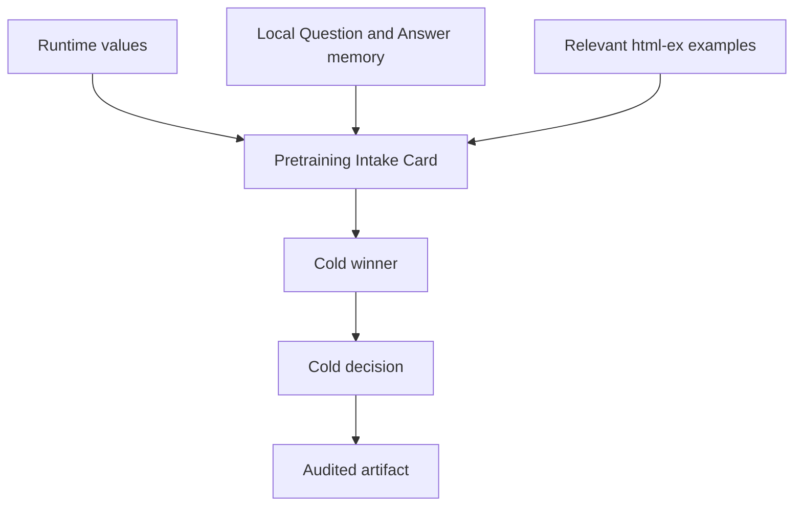
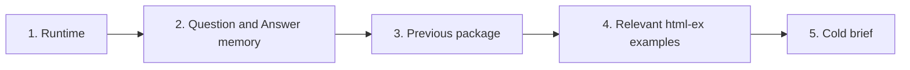

<!-- Generated from ../html_EN/pretraining-reference.html. Keep source of truth in html_EN. -->
<!-- Source stylesheet: [shared-report-reference.css](../../shared-report-reference.css) -->

# Pretraining Reference `SOURCE` `INTAKE` `ANTI-COPY` `DECISION`

- Owns pretraining.
- Defines sources, order, extraction, and anti-copy.
- Defines the artifact that closes the choice.
- `orchestrate-iterative-runs.html` remains owner for legality and handoff.


## Overview

| Badge | Read here |
| --- | --- |
| `SOURCE` | runtime, local memory, previous package, relevant html-ex, live standards |
| `INTAKE` | what you extract, what you do not inherit, what artifact you save |
| `BENCHMARK` | shape, severity, artifacts, and scoring; never copied business |
| `FEEDBACK` | lessons from `docs/out/README.md` as Q/A, not owner-law |
| `ANTI-COPY` | stop inheriting verdict, score, style, or business from examples |
| `DECISION` | frontier that wins cold and the artifact that closes the choice |

<!-- /table -->

| Category | Scope |
| --- | --- |
| Owner | `audited pretraining` `sources` `anti-copy` |
| Uses | `runtime` `local memory` `html-ex` `feedback Q/A` |
| Produces | `intake card` `frontier ranking` `cold decision` |
| Does not produce | `package legality` `run slot` `final report` |

<!-- /table -->

<details>
<summary>Base rule</summary>

Good pretraining does not inherit a verdict. It extracts pressure, severity, shape, and the cold next frontier.
</details>

<details>
<summary>Minimum contract `INTAKE` — sources, extraction, anti-copy</summary>

| Step | Rule |
| --- | --- |
| runtime | read active values and common paths; do not hardcode locally |
| local memory | read `docs/out/README.md` as `Question -> Answer`, not as law |
| previous package | extract next-run truth, blocker, family, and what must not be repeated |
| html-ex | choose relevant examples for form, severity, and artifacts; do not copy the business |
| brief scoped | written when the context requires a complete reread or a cold change of winner |

<!-- /table -->

The owner decides sources and intake. The orchestrator consumes only the audited intake, cold decision, and saved artifacts.
</details>

## 1. Flow pretraining `INTAKE` — sources -> intake -> rerank

<!-- diagram-readable-table -->
| Source / output | Extract | Do not inherit |
| --- | --- | --- |
| `agent-runtime` | active values and shared paths | hardcoded local assumptions |
| local memory | Q/A feedback and previous package truth | stale self-defense |
| `html-ex` | form, severity, artifact discipline | business verdict or score |
| Pretraining Intake Card | take / do not copy / save | unsaved reasoning |
| frontier that wins cold | reranked business opportunity | warm preference |
| legal winner | launch / rerank / stop decision | inherited benchmark identity |
| saved artifact | persisted context for the next owner | oral memory |
<!-- /table -->



<details>
<summary>2. Sources and what you extract — not everything you read becomes law</summary>

- Section 2 = extraction contract.
- Question: what do you take from each source?
- Section 3 = reading procedure.
- Question: in what order do you reopen sources?

| Source | What you extract | What you do NOT inherit | Artifact |
| --- | --- | --- | --- |
| `agent-runtime.properties` | active values, paths, current success | locally hardcoded values | runtime link in package README |
| `docs/out/README.md` | Q/A answers, repeated defects, calibrations | copied owner-law or score | frontier-ranking-ledger.md |
| latest complete local package | next-run truth, blockers, family pressure | inertial reuse of the same winner | next-run-eligibility-card.md |
| `HTML_EX_LIBRARY_README` | shape, severity, artifacts, scoring | business, verdict or score copied | round-pretraining-brief.md when the context requires it |
| live standards | current requirements and owners | historical habits from old examples | checklist in gate trace |

<!-- /table -->
</details>

### 3. Cold reread order — order matters

- The order must not change the owners.
- Scop: previne pretraining warm.
- Flux: runtime -> memory -> package local -> biblioteca common -> brief.
- The brief is written only when required.

<!-- diagram-readable-table -->
| Reread order | Purpose | Artifact / result |
| --- | --- | --- |
| 1. runtime | active values and paths | current package law |
| 2. `docs/out` | Question -> Answer feedback | local calibration |
| 3. previous package | next-run truth and blockers | continuation context |
| 4. `html-ex` | form, severity, artifact shape | benchmark pressure |
| 5. brief | cold choice | saved pretraining verdict |
<!-- /table -->



| Step | You reopen | What you must obtain |
| --- | --- | --- |
| 1 | `agent-runtime.properties` | active values and current execution truth |
| 2 | `docs/out/README.md` | accumulated calibration between agents |
| 3 | latest complete local package | next-run truth and real blockers |
| 4 | `HTML_EX_LIBRARY_README` + relevant examples | shape, severity, artifacts, scoring, without blind inheritance |
| 5 | `round-pretraining-brief.md` only when the context requires it | closed cold choice: launch, rerank, or stop |

<!-- /table -->

<details>
<summary>4. Pretraining Intake Card `INTAKE` — mandatory template</summary>

| Context | When the brief is written | Why |
| --- | --- | --- |
| fresh ROOT_RUN | always | a new package needs complete rereading and a closed cold choice |
| same-package continuation | only if reranking changes the winner or the active benchmark | otherwise keep the package brief and update the frontier ledger |
| local repair without a winner change | never | save the lesson in the run markdown; do not reinvent pretraining |

<!-- /table -->

| Field | Must fix |
| --- | --- |
| source | runtime, local memory, previous package, html-ex relevant |
| what I extract | the useful lesson for the current frontier |
| what I do NOT inherit | blindly copied business, score, winner, or verdict |
| what artifact I save | `frontier-ranking-ledger.md` always; `round-pretraining-brief.md` only for fresh ROOT_RUN or same-package reranking that changes the winner |
| which frontier wins | the current cold winner and why the others lose |
| cold decision | `launch`, `rerank` or `stop` |

<!-- /table -->

```text
round-pretraining-brief.md

source = ...

what I extract = ...

what I do not inherit = ...

artifact saved = ...

winning frontier now = ...

why it wins = ...

cold decision = launch / rerank / stop
```
</details>

<details>
<summary>5. What pretraining does not consume — anti-copy rules</summary>

- Do not consume chat verdicts as a truth source.
- Do not consume an entire benchmark as a business or score template.
- Do not consume `.java` snapshots as the primary evolution truth; the diff remains primary.
- Do not consume the newest folder on disk if branch memory and cold carriers say otherwise.
- Do not consume `docs/out/README.md` as owner-law; consume it only as iterative memory.
- Do not copy the business from `html-ex`; take only the form, severity, and good artifacts.
</details>

<details>
<summary>6. Final decision card `DECISION` — what pretraining produces for the orchestrator</summary>

| Field | Short answer | If missing |
| --- | --- | --- |
| winner | frontier that wins cold now | the launch is warm |
| what I do NOT inherit | business, score, style, or verdict copied from memory/html-ex | the benchmark contaminates the package |
| artifact saved | `frontier-ranking-ledger.md` and, when the context requires it, `round-pretraining-brief.md` | rerank is not reopenable |
| cold decision | `launch`, `rerank` or `stop` | the orchestrator has nothing to govern |

<!-- /table -->
</details>

