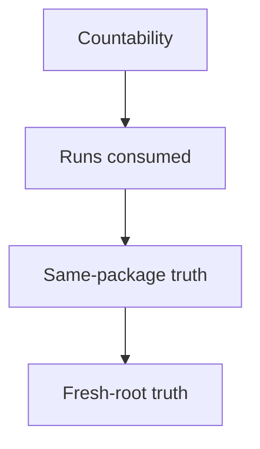

<!-- Generated from ../html_EN/reporting.html. Keep source of truth in html_EN. -->
<!-- Source stylesheet: [shared-report-reference.css](../../shared-report-reference.css) -->

# Reporting Standard `OPENING` `GRAPH` `PROOF` `CLOSE-OUT`

- Defines the canonical shape for `analysis/langgraph-business-understanding.html`.
- Publishes the frozen truth: business, proof, accounting, next move.
- Does not reinterpret runtime, launch legality, or production artifacts.


## Overview

| Badge | Read here |
| --- | --- |
| `OPENING` | hero, runtime strip, score cards, Score Overview, compact accounting |
| `GRAPH` | real application business map + package overlay |
| `PROOF` | claim -> run -> diff -> Extent/XML -> verdict |
| `AUDIT` | run audit, Artifact Index, state files, render proof, and link audit |
| `CLOSE-OUT` | countability, runs consumed, same-round, fresh ROOT_RUN, next move |
| `INVALID` | pretty report that raises the score above business substance or hides missing proof |

<!-- /table -->

| Category | Scope |
| --- | --- |
| Owner | `final page` `published shape` |
| Uses | `frozen truth` `proof links` `state files` |
| Does not produce | `runtime` `launch legality` `production accounting` |
| Appendices | `score overview` `business graph rubric` |

<!-- /table -->

Reporting is read-only publication: it takes the closed truth and makes it navigable.

<details>
<summary>Mandatory structure — reference closed by default</summary>

| Zone | Stays visible at the top? | Cold rule |
| --- | --- | --- |
| Visible top | yes | hero verdict, runtime strip, score wall, quick access to `Score Overview` |
| Folded top | only inside fold | Executive Context, extended accounting, jump links, controls, longer explanations |
| Never top | no | run audit, full Artifact Index, long proof tables, detailed close-out, score argumentation |

<!-- /table -->

| Section | What it must contain |
| --- | --- |
| 1. Opening | hero verdict<br>runtime strip<br>score wall + `Score Overview`<br>accounting compact |
| 1a. Score Overview | short collapsed subsection<br>the shape comes from `score-overview-reference.html`<br>do not reinvent locally |
| 2. Executive verdict | winner truth, strongest unresolved truth, same-round truth, fresh ROOT_RUN truth, and historical mutation versus the previous package |
| 4. Business Flow Graph | macro-map application + package overlay<br>the shape comes from `business-flow-graph-rubric.html` |
| 5. Proof and coverage | proof mapping + Artifact Index; each major claim has run, run diff, Extent/XML, verdict MD, and state file |
| 6. Run audit band | a short band per run: claim, delta, kept, diff, Extent/XML, and feedback MD |
| 7. Closure truth | x / ROUND_TARGET_TEST_COUNT<br>runs consumed = n / META_ITERATION_COUNT<br>target met<br>same-round / fresh ROOT_RUN legality<br>open problems and under-spend |
| 8. Render and audit | canonical page + shared CSS<br>render proof + link audit<br>main sections collapsible<br>`4. Business Flow Graph` open default |

<!-- /table -->
</details>

## 1. Flows and diagrams — form and proof of the final page

<details>
<summary>1.1 Quick reading map — short orientation</summary>

| If you ask | Open | You learn cold |
| --- | --- | --- |
| what should the first screen look like? | `1.2` | order hero -> runtime -> score cards -> Score Overview -> accounting -> verdict |
| how does reporting read frozen truth? | `1.2.1` | read-only state machine of the final page |
| how should the application, not the package, be drawn? | `1.3` | macro-business map + local overlay |
| how do I link the claim to proof? | `1.4` | claim chain -> run -> diff -> Extent -> verdict |
| what truths must I not mix? | `1.5` | countability, runs consumed, same-package, fresh-root |

<!-- /table -->

- `1.2` = opening.
- `1.3` = map application.
- `1.4` = proof.
- `1.5` = separate verdicts.
</details>

### 1.2 Opening shape — first-screen shape

<!-- diagram-readable-table -->
| Opening block | Reader learns | Keep it |
| --- | --- | --- |
| Hero | short verdict | business-first |
| Runtime strip | active values | compact |
| Score cards | visible axes | canonical |
| Score Overview | why Overall sits there | separate subsection |
| Accounting compact | target / run truth | integrated, not separate |
| Section 2 | executive verdict | below the opening |
<!-- /table -->


<details>
<summary>Legend</summary>

- Score cards and `Score Overview` are not the same block; the overview remains a separate subsection.
- Accounting must be integrated after the score area, not as a weak separate helper.
- Jump links are good only if they do not fill the opening with noise.
</details>

<details>
<summary>1.2.1 Minimum reporting state machine — truth frozen -> final page</summary>

```text
read_package_state

-> read_frozen_truth

-> build_business_graph

-> map_claims_to_proof

-> assemble_run_audit

-> render_and_link_audit

-> publish_final_html
```

| Step | What you read | What you must not do |
| --- | --- | --- |
| `read_package_state` | state files and close-out carriers | do not invent new values or new legality |
| `build_business_graph` | application macro-map + package overlay | do not turn the graph into a run journal |
| `map_claims_to_proof` | run diff, Extent, XML, decisive markdown artifacts | do not leave claims without owner and without proof |
| `render_and_link_audit` | CSS common, render proof, link audit | do not publish a beautiful but unauditable page |

<!-- /table -->

- Reporting does not rejudge.
- Read the already frozen state and truth.
- Verify whether the final page is navigable and cold.
</details>

<details>
<summary>1.3 Business Flow Graph — application map + package overlay</summary>

- Here reporting validtes only shape.
- The canonical LangGraph lives in `business-flow-graph-rubric.html`.
- The rubric, examples, and bad smells live there too.

| Loc | Role |
| --- | --- |
| `1.3` | validtes the graph shape and points to the reusable rubric |
| `4` | describes the mandatory minimum content of the final report |

<!-- /table -->

- `1.3` does not duplicate section `4`.
- Shape is calibrated in the rubric.
- Published content remains in the report.
</details>

### 1.4 Claim -> proof -> artifact — minimum publication chain

<!-- diagram-readable-table -->
| Proof link | Publishes | Must point to |
| --- | --- | --- |
| Business claim | what the report says happened | business object or rupture |
| Run | local owner of the claim | run audit band |
| Diff | source evolution | run diff / root diff |
| Extent | execution evidence | visual/report proof when available |
| Verdict MD | owned / partial / blocked truth | frozen review artifact |
<!-- /table -->


<details>
<summary>Legend</summary>

- Every published claim must have an owner and navigable proof.
- If the owner, diff, or proof carrier is missing, the claim is not cold.
- The published claim must sound higher than the test name that supports it.
</details>

### 1.5 Truths that must not be mixed — countability, runs consumed, same-round, fresh-root

<!-- diagram-readable-table -->
| Truth | Published as | Must not be confused with |
| --- | --- | --- |
| Countability | `x / ROUND_TARGET_TEST_COUNT` | number of run slots |
| Runs consumed | spent slots against `META_ITERATION_COUNT` | number of tests |
| Same-package blocked | no more continuation here | fresh ROOT_RUN legality |
| Fresh ROOT_RUN legal | next package possible | automatic launch readiness |
<!-- /table -->



<details>
<summary>Legend</summary>

- These four verdicts are different even if they appear in the same close-out.
- `same-package blocked` does not automatically mean `fresh ROOT_RUN legal = no`.
- If these truths are mixed, the report sounds safer than it is.
</details>

<details>
<summary>2. Opening `OPENING` — hero, score wall, Score Overview, accounting compact</summary>

<details>
<summary>2.1 Opening Contract Card — what remains visible and what moves down</summary>

| visible sus | Collapsed / more jos |
| --- | --- |
| hero verdict | long scoring explanations |
| runtime strip | runtime doctrine |
| visible score wall + collapsed Score Overview | self-defense argumentation |
| accounting compact | tabele late de audit |
| short executive verdict | details de test, repair, helper, selector |

<!-- /table -->

- The report publishes; it does not rejudge.
- Every important claim has a local hyperlink to proof.
- The final published shape lives here, not in the execution documents.
- All main sections are collapsible.
- The only main section open by default: `4. Business Flow Graph`.
</details>

<details>
<summary>2.2 Mandatory opening elements — hero + score wall visible; heavy context collapsed</summary>

| area | Model cerut | Cold rule |
| --- | --- | --- |
| Hero | titlu scurt + badge de state | state the package truth, not marketing |
| Score wall | visible cards for the canonical axes, including `Overall` | values follow `score-overview-reference.html` |
| Executive Context | collapsed subsection with runtime pills, short context, owned / blocked | do not keep heavy context open by default |
| Read First | mini-card with root diff or main historical artifact | the first link must help cold reopening |
| Compiled State | mini-card with `package-state.json` | the compiled state is not hidden in Artifact Index |
| Execution Gate | mini-card with `execution-gate-card.md` | package completeness must be quickly verifiable |
| Jump links | short links to Score Overview, Business Flow Graph, Proof, Close-Out | navigation, not ornament |
| Colapsare | after opening, the main sections are collapsible | in final report, only Business Flow Graph remains open default |

<!-- /table -->

- Good model: `score wall` visible, heavy context in `Executive Context` collapsed.
- Not pune tabele late, audit complet or explicatii lungi in primul ecran.
- Runtime and counters appear as short pills; their doctrine remains in the owner artifacts.
</details>

<details>
<summary>2.3 Accounting Compact — short form published in the opening</summary>

```text
Accounting Compact

  tests produced = x / ROUND_TARGET_TEST_COUNT

  runs consumed = n / META_ITERATION_COUNT

  breadth = broad / partial / narrow

  same-round continuation = yes / no / blocked

  fresh ROOT_RUN = yes / no

  owner = quality-accounting-verdict.md
```
</details>
</details>

## 3. Executive verdict `CLOSE-OUT` — winner, under-spend, next move

| Block | Minimum content |
| --- | --- |
| Winner truth | what new business became cold, owned, and countable |
| Strongest unresolved truth | which relevant frontier remained partial, blocked, or fresh-round-only |
| Same-round stop truth | why same-package continuation is legal or not |
| Fresh ROOT_RUN truth | whether the next step must move into a new package |
| Historical mutation | in 1-3 lines: what this package changed versus the previous package, with an early link to `root-source-thin-no-index.diff` |

<!-- /table -->

- Report final not devine jurnal lung.
- Still, the opening must have a short historical mutation.
- Without it, diffs remain too low and hard to read pedagogically.

### 3.1 Cold reading discipline — opening shape, good order, cold benchmark

<!-- diagram-readable-table -->
| Reading order | Contains | Reader should understand |
| --- | --- | --- |
| Opening | hero + cards + accounting | verdict before tests |
| Verdict | winner + under-spend + next move | why the package matters |
| Graph | business story | application map + package overlay |
| Proof mapping | claim -> run -> proof | how to reopen evidence |
| Audit | run strip | what each run changed |
| Close-out | final truth | what continues or stops |
<!-- /table -->


<details>
<summary>Legend</summary>

- Do not let the opening become a technical index.
- Do not let tests explain the business before the verdict.
- Do not lift the heavy payload above proof mapping.
</details>

| Rule | Cold form |
| --- | --- |
| Opening shape | hero -> runtime strip -> canonical score wall<br>Score Overview -> integrated accounting -> section 3<br>without a separate contradictory block between score and verdict |
| Opening clutter | do not publish accounting, yield, or weak comparator helper as a separate opening block |
| Reading order | the reader must understand the verdict and the business first, not the tests or the repair trail |
| Payload moved down | run ids, test names, repair steps<br>selectors, concrete payload, micro-mutations<br>location: legend, proof mapping, audit strip, artifact index |
| Benchmark cold | for form comparison, reopen the benchmarks selected in pretraining; there is no single rigid teacher |

<!-- /table -->

If the reader must understand the tests first to understand the business winner, the report is wrong.

<details>
<summary>4. Business Flow Graph `GRAPH` — the pedagogical center of the report</summary>

- Only the mandatory final-report slot remains here.
- In this requirements document: collapsed by default.
- In the final report: the only section open by default.
- Form and validation come from `business-flow-graph-rubric.html`.

| In the report this must be published here | Minimum accepted |
| --- | --- |
| macro-map application | real product lanes, not a run list |
| package overlay | what became owned, partial, blocked, or fresh-round-only |
| legend collapsed | test details, run ids, method, and repair trail stay below the graph, not inside nodes |
| link to proof | send the reader to proof mapping, run audit, and Artifact Index |

<!-- /table -->

- Application is map.
- The package colors only what it touched.
- Drawing and validation: `business-flow-graph-rubric.html`.
</details>

<details>
<summary>5. Proof and coverage `PROOF` — mapping, diff, Extent, artifact index</summary>

<details>
<summary>5.1 Ownership = truth closed — claim -> run -> proof</summary>

| Coloana | What must exist |
| --- | --- |
| Business claim | cold claim about a business step or identity, not only about a green test |
| Run owner | link to `runs/run_##/SUMMARY.md` |
| Evolution truth | link to `runs/run_##/review/thin-no-index.diff` for run claim; `root-source-thin-no-index.diff` only for package synthesis |
| UI proof | link to `ExtentReport_*.html` for UI packages |
| Machine proof | link to XML or `command-result.md` |
| Cold verdict | owned / partial / blocked / fresh-round-only |

<!-- /table -->

```text
run diff = small mutation

root diff = compiled mutation

carrier = support only if the diff is not enough
```

- Every important claim has a link to diff.
- Every claim also has a historical mutation sentence.
- Say: what s-a open, closed or ingustat.

- Without run diff, the claim has no complete cold history.
- The root diff does not compensate for the missing small diff.
</details>

<details>
<summary>5.2 Artifact Index = where you reopen proof — what must be hyperlinked</summary>

- Formula: `claim major -> run -> run diff -> Extent/XML -> verdict MD -> state file -> status`.
- One row per major claim published in Verdict, Business Flow Graph, or Proof Mapping.
- Inventarul brut sta in frozen inventory.

| family | Mandatory artifact | Role |
| --- | --- | --- |
| Runtime | `agent-runtime.properties` | common truth of thresholds and paths |
| Evolution | `runs/run_##/review/thin-no-index.diff` + `review/root-source-thin-no-index.diff` | run diff for local mutation; root diff for package compilation |
| Proof UI | `ExtentReport_*.html` | coloana principala de proof for UI |
| Proof machine | `testng-results.xml`, `TEST-*.xml`, `command-result.md` | machine-readable execution truth |
| Run audit | `SUMMARY.md`, `artifact-checklist.md`, `score-support.md` | truth kept/countable |
| Governance | `quality-accounting-verdict.md`, `next-run-eligibility-card.md`, `package-close-out.md`, `package-state.json`, `execution-gate-card.md` | accounting, legality, close-out, and compiled state |
| Per-run state files | `runs/run_##/review/run-state.json` | links every major claim to the cold run state that produced it |
| Constructive learning | any `*.md` that influenced the verdict | auditable feedback from the agent |
| Publication | `shared-report-reference.css`, `canonical-render-check.png`, `local-link-check.txt` | render proof and link reopenability proof |

<!-- /table -->

Artifact Index is mandatory per major claim; extra value does not replace it.

| Claim major | Run | Run diff / source | Extent / XML | Verdict MD | State file | Status |
| --- | --- | --- | --- | --- | --- | --- |
| claim published in verdict, graph, or proof mapping | `run_##` or `package` | link to diff/source or `missing` | link to Extent/XML or `n/a` | link to the MD that owns the verdict | link to `run-state.json` or `package-state.json` | `linked / missing / n/a` |

<!-- /table -->

- Artifact Index is not decorative inventory.
- Claim without a complete chain remains partial.

- claim -> run diff
- synthesis -> root diff
- carrier -> only when the claim requires additional interpretation

- State files apar here and in Close-Out.
- `package-state.json` = truth compilat.
- `run-state.json` = claim greu dependent de un slot.
</details>

<details>
<summary>5.3 Allowed extra value — freedom after the mandatory skeleton</summary>

| You may add | When it is worth it | Conditie cold |
| --- | --- | --- |
| subgrafuri business suplimentare | when un singur graph mare devine greu de citit | short collapsed legend under each subgraph |
| mini blocker matrix | when blockers must be separated more clearly | each row has a link to proof |
| short local comparator | when a real comparator clarifies the standing | so it does not become a vanity strip |
| learning notes per frontier | when saved feedback materially changes the next run | only with local markdown hyperlinked |
| specialized proof subsections | when a flow needs separate explanation for diff, Extent, XML, or render | do not duplicate the Artifact Index |

<!-- /table -->

- The mandatory skeleton comes first.
- After it, the agent may add useful subsections.
- Conditie: to mareasca claritatea de Reopenre.

- missing `package-state.json` = report partial.
- missing promised run-state files = partial report.
- Beautiful HTML does not compensate for missing state files.
</details>
</details>

<details>
<summary>6. Run audit band `AUDIT` — one cold band per run</summary>

| Coloana | Minimum content |
| --- | --- |
| Run | `run_##` + link to `SUMMARY.md` |
| Business claim | what it tried to defend and why that run was worth consuming |
| Expected delta | what kind of novelty or depth was expected |
| Actual delta | what materialized cold and what historical mutation it added versus the previous state |
| Kept? | yes / no |
| Why countable / not countable | motiv cold, scurt |
| Diff | link to the relevant small run diff; not only to root diff |
| Extent | link for UI or `n/a` explicit |
| Feedback | link to saved constructive feedback |

<!-- /table -->

- Only root diff = partial history.
- Run audit must lead to the small deltas per run.

- Order good: claim -> run -> run diff -> Extent/XML -> verdict.
- Another order slows historical reading.

- Run with changed source requires a link to `runs/run_##/review/thin-no-index.diff`.
- Without a link, the row is publicly incomplete.

- What did the run prove?
- What changed in package history?
</details>

<details>
<summary>7. Closure truth `CLOSE-OUT` — countability, legality, next move</summary>

<details>
<summary>7.1 Separate publication of closure truths — separates countability, runs consumed, and next move</summary>

| Must stay separate | What you publish |
| --- | --- |
| Countability | `materially turned into tests = x / ROUND_TARGET_TEST_COUNT` |
| Runs consumed | `runs consumed = n / META_ITERATION_COUNT` |
| Accounting target | `accounting target met = yes / no` |
| Business breadth verdict | `broad / partial / narrow` + motiv cold |
| Same-round continuation | `same-round continuation legal = yes / no` |
| Fresh ROOT_RUN legality | `fresh ROOT_RUN legal = yes / no` |
| Open problems | the hardest remaining truths and any unresolved under-spend on tests or runs |

<!-- /table -->

- Do not mix into a single sentence:
- countability, breadth, runs consumed, yield, application exhaustion.
- Counters remain separate.

- The report publishes accounting and close-out already decided.
- Do not move target-production theory here.
- Shows clearly what came out and the final verdict.

- Close-Out shows `package-state.json`.
- Close-Out shows `execution-gate-card.md`.
- If the verdict depends on a run, show `run-state.json` too.
</details>
</details>

<details>
<summary>8. Render and audit `AUDIT` — style, screenshot, hyperlinks</summary>

| Check | Must be published |
| --- | --- |
| Canonical page exists | `analysis/langgraph-business-understanding.html` |
| Shared CSS used | link local la `shared-report-reference.css` |
| Render proof | `canonical-render-check.png` |
| Link audit | `local-link-check.txt` |
| Collapsible discipline | large collapsible sections, short legends under subgraphs |

<!-- /table -->

- `canonical-render-check.png` must show the real report.
- `not found`, gray screen, cookie wall, or foreign page = invalid.
- Report cade cold chiar if HTML-ul and linkurile exists.

- Without valid render proof: `New Artifacts Contract` remains at most partial.
- The publishing blocker must be linked explicitly.
</details>

