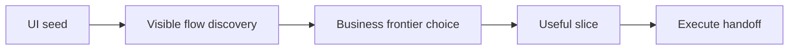
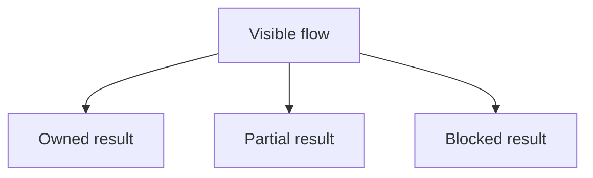
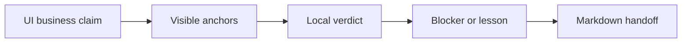

<!-- Generated from ../html_EN/ui-business-frontier-adapter.html. Keep source of truth in html_EN. -->
<!-- Source stylesheet: [shared-report-reference.css](../../shared-report-reference.css) -->

# UI Business Frontier Adapter `UI` `FRONTIER` `PROOF` `HANDOFF`

- UI adapter for a single run.
- Starts from `SEED_RECORDING_CLASS`.
- Chooses a visible business frontier.
- Produces the test/support slice.
- Hands cold proof to execution.


## Overview

| Badge | Read here |
| --- | --- |
| `UI` | what is visible on the page: route, form, message, state, screenshot, anchor |
| `FRONTIER` | new uncovered business: actor, intent, visible step, result |
| `DELTA` | new business truth; judged before UI proof |
| `HANDOFF` | material handed to `execute-and-understand-run.html` |
| `WRAPPER` | UI specialization over canonical run execution |

<!-- /table -->

| Category | Scope |
| --- | --- |
| Owner | `slot UI frontier` `actor` `intent` `visible proof` |
| Uses | `UI runtime` `seed` `audited pretraining` |
| Delegates | `slot material to execute-and-understand-run` |
| Produces | `UI material` `local claim` `proof anchors` |
| Does not produce | `package legality` `fresh ROOT_RUN` `final report` |

<!-- /table -->

<details>
<summary>UI runtime reference `RUNTIME` — UI bindings read live</summary>

| Binding | Role | Anti-drift |
| --- | --- | --- |
| `SEED_RECORDING_CLASS` | visible entry point | does not become suite design |
| `TARGET_TEST_PACKAGE` | UI test destination | do not scatter without a cold reason |
| `UI_TEST_ROOT` | test class root | do not leave the declared surface |
| `UI_SUPPORT_ROOT` | UI support root | do not hide business in helpers |

<!-- /table -->

- The UI adapter reads runtime live.
- Active values become the law of the current slot.
- General run artifacts remain in `execute-and-understand-run.html`.
</details>

<details>
<summary>1. Adapter boundary `WRAPPER` — one UI run, not the package</summary>

| Owns here | Forwards | Does not own here |
| --- | --- | --- |
| UI seed<br>visible frontier<br>test/support delta<br>UI proof<br>local feedback | UI claim<br>visible anchors<br>blockers<br>local lessons<br>meaning of the UI proof | package legality<br>run consumption<br>final close-out<br>final page |

<!-- /table -->

- If you talk about what is visible in the UI, you are in the adapter.
- If you talk about what is saved, counted, or fixed, you are in `execute-and-understand-run.html`.

<details>
<summary>1.1 Minimum contract</summary>

- The seed is the entry point, not the verdict.
- The frontier is business-first: actor, intent, visible step, result.
- The run produces auditable tests for the chosen anchor or hands off a severe blocker.
- Without visible business outcome and explainable UI proof, the flow remains investigation.
- Minimum handoff: UI claim, visible anchors, local result, blocker, and lesson.
</details>

- Strict document for the visible UI frontier.
</details>

## 2. Flows and diagrams — single UI run band

<details>
<summary>2.1 Quick reading map — short orientation</summary>

| Reading | Open | You learn |
| --- | --- | --- |
| band | `2.2` | UI wrapper over canonical run execution |
| classification | `2.3` | owned / partial / blocked |
| handoff | `2.4` | UI claim, anchors, local verdict, blocker, lesson |

<!-- /table -->
</details>

### 2.2 UI lane over execute-and-understand-run `WRAPPER` — UI specialization, canonical fixation

<!-- diagram-readable-table -->
| UI wrapper step | Adapter decision | Handoff |
| --- | --- | --- |
| Seed | first visible clue | entry point, not business model |
| Discover UI | routes, forms, links, visible states | candidate anchors |
| Choose frontier | new business uncertainty | local claim |
| Implement the slice | small but relevant delta | test/support material |
| Handoff to execute | anchors + lessons | material for canonical fixation |
<!-- /table -->



<details>
<summary>What the UI adapter adds vs what execute manages</summary>

| UI adapter adds | `execute-and-understand-run.html` manages |
| --- | --- |
| actor, intent, visible step, UI state | canonical run fixation |
| the meaning of screenshots and visible anchors | reopenable proof |
| owned / partial / blocked locally | the cold verdict and package memory |

<!-- /table -->
</details>

<details>
<summary>How to read the strip</summary>

- `Seed` is only the entry point, not the verdict.
- `Discover UI` means visible routes, states, and intents, not recorder replay.
- `Choose frontier` means the most valuable locally visible business mutation.
- `\`Implement the slice\` must leave a small but countable delta.`
- `Handoff to execute` leaves UI material for canonical fixation.
</details>

<details>
<summary>2.2.1 Minimum UI adapter state machine — seed -> proof -> execute handoff</summary>

```text
read_seed

-> discover_business_object

-> choose_visible_frontier

-> implement_slice

-> execute_and_capture

-> handoff_to_execute_and_understand_run
```

| Step | Minimum output |
| --- | --- |
| `discover_business_object` | actor, intent, and business object, not just page |
| `choose_visible_frontier` | local claim with a possible visible result |
| `execute_and_capture` | visible anchors and the meaning of UI proof |
| `handoff_to_execute_and_understand_run` | UI material for canonical fixation |

<!-- /table -->

- The UI adapter does not fix the package by itself.
- Hands off the cold material of a single slot.
- `execute-and-understand-run.html` closes the verifiable run.
</details>

### 2.3 Frontier UI: owned / partial / blocked — UI-adapter-specific reading

<!-- diagram-readable-table -->
| UI verdict | Means | Countability |
| --- | --- | --- |
| Visible flow | route / form / state can be inspected | candidate only |
| Owned | stable visible result with business meaning | can become countable |
| Partial | useful support, no new business | support only |
| Blocked | unstable or insufficient proof | document and rerank |
<!-- /table -->



<details>
<summary>Legend</summary>

- `owned` requires stable and explainable visible UI result.
- `partial` may repair support without gaining new business identity.
- `blocked` means the UI does not cold-close the frontier, not merely that the test was inconvenient.
</details>

| Frontier quality | Must answer | If the answer is weak |
| --- | --- | --- |
| expected business delta | what new truth about the application changes the business map, not just visible proof? | reject helper-only work<br>reject selector-only work<br>reject shell reachability without a new business object |
| materialized object / blocker | which object, property, history, ownership, or severe blocker becomes verifiable? | reject the winner if it remains only a visible page or successful click |
| expected UI proof | which visible anchors and screenshots can support the claim? | reject the winner if the meaning of UI proof cannot be explained |
| helper / locator risk | does business change, or only technical support? | mark `blocked if only locator-helper work` |

<!-- /table -->

- Business delta is judged before UI proof.
- A weak frontier stops here.
- Without a materializable business object: not a winner.
- Without explainable UI proof: not a winner.

### 2.4 What hands off the UI adapter `HANDOFF` — handoff to execute-and-understand-run

<!-- diagram-readable-table -->
| Handoff item | Meaning | Execute uses it for |
| --- | --- | --- |
| Business claim | what the UI slice tried | run intent |
| UI anchors | what is visible | proof navigation |
| Local verdict | owned / partial / blocked | countability support |
| Blocker / lesson | what the run learns | rerank and feedback |
| Feedback MD -> execute | material for fixation | state, proof, and package memory |
<!-- /table -->



<details>
<summary>Legend</summary>

- `3.4` says what exits the run.
- `5` says how the proof of those outputs is validated.
- The UI adapter hands off the cold material: claim, anchors, local verdict, blocker, and lesson.
- `execute-and-understand-run.html` decides canonical fixation.
- `orchestrate-iterative-runs.html` decide legality.
- `reporting.html` publishes the final page.
</details>

<details>
<summary>3. Freedom model — heuristics, not a corset</summary>

| The agent is free on | Keep strict on |
| --- | --- |
| UI exploration order<br>locator strategy<br>auxiliary notes<br>local repair<br>first attempted branch | new business<br>visible anchors<br>local verdict<br>owner boundary<br>meaning of the UI proof |

<!-- /table -->

We do not impose rigid micro-steps. But tactical freedom does not reduce the target, proof, or owner boundary.
</details>

<details>
<summary>4. Rapid reject gate `FRONTIER` — stops procedural work before winner selection</summary>

| Reject cold if | Why | What you ask for instead |
| --- | --- | --- |
| helper-only | grows support, not business understanding | actor + intent + visible result |
| shell-only | the page exists, but the business object is missing | row, id, status, cold input, message, or another verifiable entity |
| same absence replay | reconfirms the same absence without new delta | a new angle: actor, state, persistence, recovery, or downstream effect |
| no countable business delta | does not change the package verdict | countable claim with business object or documented severe blocker |

<!-- /table -->

- This gate applies after exploration freedom and before implementation.
- If it fails here, do not save the run as the frontier winner.
</details>

<details>
<summary>5. Choosing the UI business frontier — the seed is not the business model</summary>

- Generic map: `baseline -> frontier -> owned / partial / blocked / fresh-round-only`.
- Owner: `orchestrate-iterative-runs.html`.
- Here remains only UI-adapter-specific reading.

| UI question | Desired answer | Handoff UI |
| --- | --- | --- |
| What real flow does the seed expose? | a business flow, not a recorder replay | why the seed helps or misleads |
| Which UI actor and intent are worth attacking? | a visible journey, not only a component or locator | why this frontier wins locally |
| What visible step changes business truth? | route, form submit, toggle, compare tray, protected state, or another visible mutation | the visible anchors and their business meaning |
| What can become owned / countable? | only the branch with stable visible result and explainable UI proof | local verdict: owned / partial / blocked |
| What remains blocked or fresh-round-only? | published cold, without inventing closure | `ui-blocker-note.md` or next-run truth from the owner documents |

<!-- /table -->

Business object first, selector second. Hand off actor, intent, visible step, result, and the decisive local lesson.

- The final graph shape belongs to reporting.
- Rubric is `business-flow-graph-rubric.html`.
- Here it hands off only the cold material of the UI run.
</details>

<details>
<summary>6. Meaning of UI proof `PROOF` — what the adapter explains, not what it fixes</summary>

- `3.4` hands off the UI meaning of the proof.
- `execute-and-understand-run.html` manages canonical fixation.

| UI question | Mandatory answer |
| --- | --- |
| What is visible? | visible step, state, message, row, card, form, or local result |
| Why does it matter? | what business truth it changes or blocks |
| Who is the target? | the exact actor and UI object, without ambiguity |
| What remains partial? | visible limit, blocker, or missing object |

<!-- /table -->

For UI, proof without the explanation of visible anchors remains incomplete.
</details>

<details>
<summary>7. Feedback UI for next agent `HANDOFF` — lessons, not a file inventory</summary>

| Category | When it appears | What the next agent must learn |
| --- | --- | --- |
| frontier map | when there are multiple routes / links / branches | covered / blocked / duplicate / deferred / still-open |
| proof meaning | for a proof-bearing UI run | anchors, forms, overlays, and visible states |
| target identity | when repeated lists, cards, or rows exist | how the exact target is distinguished |
| blocker | when proof cannot be closed | missing input, popup, auth, seeded data, or external boundary |
| mechanism learning | when a reusable interaction was discovered | locator/wait/interaction pattern, without selling it as new business |

<!-- /table -->
</details>

<details>
<summary>8. Handoff to execute-and-understand-run `HANDOFF` — what the UI wrapper returns</summary>

```text
the UI adapter returns

  business claim

  actor + intent + visible step + local result

  frontier quality: expected business delta / UI proof meaning / helper risk

  owned / partial / blocked classification

  visible anchors and the meaning of screenshots

  blocker or UI limit, if present

  decisive UI lessons

  kept/countable recommendation for execute-and-understand-run
```

- `execute-and-understand-run.html` fixes package memory.
- `orchestrate-iterative-runs.html` decides next-run legality.
- Reporting publishes the final map.
</details>

<details>
<summary>9. Common support references `RUNTIME` — runtime, architecture, benchmarks</summary>

| Source | Cold role | What must not be done |
| --- | --- | --- |
| `agent-runtime.properties` | thresholds, paths, and common bindings | do not redefine ad-hoc values or roots in the run |
| `Living_Architecture_UI_API_doc_v1_0.html` | framework reference for UI, configured targets, layers, and technical execution rules | do not turn the API side into this document's object and do not use it as owner of iterative legality |
| selected benchmarks in pretraining | style, graph, history, and audit references already selected in the audited intake | do not inherit their scores, standing, or business |

<!-- /table -->

- Sources are reopened for calibration and severity.
- The UI adapter uses their context.
- Further on, it hands off only the cold material of the current run.
</details>

